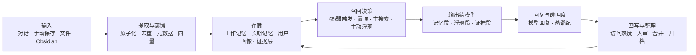

# AZOTH_mem

**AI 伴侣的活体记忆系统**：把一次次对话变成可追溯、可整理、会随使用改变召回优先级的长期心智。

> **文档 v6.0 · 2026-07-19**
>
> 本版按 AZOTH 当前本地主线重新核验，重点补齐输入 → 处理 → 输出的完整闭环，并清退旧架构图里已经失真的远期提案。

## 一句话看懂

AZOTH 不把“最近聊过什么”“长期记住什么”“角色怎样理解用户”“原话证据在哪里”混成同一团。

它把记忆分成四个彼此协作的层：

| 层 | 回答的问题 | 当前载体 |
|---|---|---|
| 角色身份 | “我是谁？” | `role-persona.md`，由人维护 |
| 用户画像 | “我长期怎样理解你？” | `user-persona.md`，可由 Phase 2 蒸馏维护 |
| 工作记忆 | “我们最近聊了什么？” | `longTermMemory`，负责短期连续性 |
| 长期记忆与证据 | “我们经历过什么？原话在哪里？” | `memory_index` + Obsidian/上传文件/出生证 |

核心原则仍然是：

> **记忆负责想起，证据负责证明，链接负责把两者牵回来。**

---

## 完整闭环



### 1. 输入

记忆可以从这些入口进入：

- 对话中的 `memory_save`；写链已存在，但模型能否主动调用仍受能力挂载和权限策略控制；
- 角色聊天达到轮次阈值后产生的小总结；它还要求自动总结开关和可用副模型，并可按重要度同步长期索引；
- Phase 2 对一批小总结做更高层蒸馏；
- 人在记忆工作台手动新建、编辑、置顶、归档；
- 文件或 Obsidian 材料先进入证据/待审核链，再由人确认；
- 原生 Agent 通过记忆工具主动保存。

### 2. 处理

长期记忆写入时会经过：

- 原子化与组装：一组相关记忆共享 `group_id`；
- 去重与人审：避免自动合并珍贵但相似的经历；
- 本地主向量：bge-small-zh-v1.5，当前为 **512 维**；
- 组级影子向量：Qwen3-Embedding-0.6B，当前为 **1024 维**；
- 结构化元数据：多值 `scopes`、`recall_hints`、`save_reason`、情绪暗流、里程碑等；
- 证据锚：原始对话窗口、Obsidian 文档、文件段落和逐字引用验证。

### 3. 召回

AZOTH 不是每轮都把整座记忆库塞给模型，而是分通道工作：

1. **置顶通道**：少量核心记忆稳定在场，但“在场”不会冒充“被想起”。
2. **主搜索通道**：显式回忆或意图判定触发后，关键词与双向量车道共同找出最相关的记忆。
3. **主动浮现通道**：在开关允许时，让高热、语义相关、同域或情绪同频的记忆自然冒出来。
4. **证据通道**：命中记忆后，把关联原文以路径、片段或全文三档牵回来。

### 4. 输出

模型实际收到的是已经分区的上下文：

- 置顶记忆；
- 本轮检索记忆；
- `💭` 标识的主动浮现记忆及原因；
- `📎` 标识的原文证据；
- 用户画像与工作记忆。

回复完成后，本轮还会生成一份只读的 **“蒸馏纪”**：记录是否触发召回、哪些记忆域被激活、用了哪种召回方式、浮现原因和证据数量。它用于向人解释本轮发生了什么，**不会在下一轮重新喂给模型**。

---

## Scope 与情绪召回：现在到底做到哪了？

塔拉记得没错：**副模型的同一次意图观察，已经同时产出 scope 和当前情绪极性。**

它会给出：

- `memory_scopes`：relationship、emotion、health、task、study、daily 等 1–3 个当前相关域；
- `memory_valence_band`：negative、mixed、positive、neutral；
- 同一观察里还包含关系权重、脆弱信号、语境模式等信息。

这些信号目前的真实作用边界是：

- scope 和情绪信号**不改写记忆内容**；
- 它们**不参与主搜索公式的硬过滤**，不会因为没标签就删掉或压死旧记忆；
- scope 路由在主动浮现池里给同域记忆加权，并可从整库补入低热但同域的旧记忆；
- 当当前消息和候选记忆都属于 emotion 域，且正/负情绪极性同频时，候选会获得额外浮现加权，界面原因显示为“情绪同频”；
- 这套能力已有实现和专项回归，但依赖主动浮现、scope 路由、情绪暗流等灰度开关；
- PWA 当前默认把主动浮现关掉；Discord 链目前没有同一套意图观察输入，因此不能把它描述成“全入口默认生效”。

所以最准确的一句话是：

> **Scope 与情绪同频浮现已经实现，但属于受灰度开关和入口差异约束的召回增强，不是全局常开的情绪引擎。**

---

## 记忆怎样“活着”

### 热度与长期分量

记忆正文不会自动变模糊，但它被想起的难易会变化：

```text
短期热度 = 初始温度 × 指数衰减 + 召回加成
半衰期   = 基础半衰期 × (1 + 被想起次数 × 延长系数)
长期分量 = 重要度 × 情绪唤醒修正
```

新记忆有冷启动保护；常被真正召回的记忆半衰期更长；置顶只表示稳定在场，不增加召回次数。

### 四个正交状态

| 维度 | 含义 |
|---|---|
| `pinned` | 独立在场通道 |
| `resolved_at` | 事情是否已经结束；普通召回沉底，显式追问可减免 |
| `visibility` | 公共、角色私有、空间私有或仅归档管理可见 |
| `importance` | 这件事本身有多重要 |

`archive_only` 会退出 AI 的主动视野，只保留在人类管理面；它不是“深搜仍自动出现”。

### 多角色与空间边界

- 角色私有记忆由 `character_id` 隔离；
- 公共记忆使用 `character_id IS NULL`，并且必须是 `shared_public_fact`；
- `private_space` 继续受具体空间约束；
- 置顶、主搜索、主动浮现和合并操作都要遵守这些边界；
- 项目记忆另有项目范围，未进入项目的对话不会随意召回项目私有记忆。

---

## 用户画像：不是角色自我改写

旧文档把“人设”和“用户画像”混在一起，因此说“AI 不会修改 persona”已经不够准确。

- `role-persona.md` 是角色身份与行为核心，仍由人维护；
- `user-persona.md` 是角色对用户的长期理解，采用“当下最在意 / 近月 / 更早 / 长期稳定”四层时间结构；
- 当 `PHASE2_OUTPUT_MODE=persona` 时，Phase 2 会更新用户画像，而不是继续往 `memory_index` 追加一批画像碎片；
- 写前留快照，画像正文与支持它的记忆组证据分开保存；人工编辑优先；
- 未配置该模式时，代码仍走兼容旧链，不能把画像蒸馏写成所有环境默认启用。

---

## 旧架构里的五个提案，现在怎样处理

| 旧提案 | 当前结论 | 文档处理 |
|---|---|---|
| 记忆软化 1.0→0.5→0.3 | **未实现，也不是当前下一阶段。** 现有的是召回热度变化，不会降低正文分辨率 | 移出当前路线，仅保留为未来重新评估的灵感 |
| Enso 治理层 | **只有声明和只读展示，没有运行时。** 它治理插件/工具执行，不是记忆召回主链 | 从记忆架构移除，单独归入工具治理 |
| Dream / 月度整合 | **没有定时整合、矛盾消解或自动做梦任务** | 不再列为当前计划；仓库里的 dreaming 日记技能不等于记忆整合 |
| 时间线 / 关系图谱 | **已有时间浏览工具、关系边和人审链；没有前端时间线或图谱画布** | 标成“底座部分存在，可视化未做且未排期” |
| 情绪调节浮现 | **已经实现，受灰度和入口限制** | 从“未来设想”移到“现有召回增强” |

---

## 当前能力状态

| 能力 | 状态 |
|---|---|
| 记忆工作台、状态编辑、人工合并、待审核箱 | 已运行 |
| 关键词 + bge + Qwen3 RRF 主召回 | 已实现，默认引擎为 blended |
| 置顶、resolved 沉底、空间/角色/项目隔离 | 已运行 |
| Obsidian/文件证据锚与三档注入 | 已运行，部分证据推荐仍受开关控制 |
| 主动浮现 | 已实现但默认关闭 |
| Scope 路由、提示向量、共现与整库冷候选 | 已实现但需独立开关 |
| 情绪同频浮现 | 已实现但需独立开关，且要求 scope 路由输入 |
| `user-persona.md` 活画像蒸馏 | 已实现，是否启用由 Phase 2 模式决定 |
| 蒸馏纪透明度 | 已实现 |
| 记忆时间浏览 | 工具层已实现；专用时间线 UI 未实现 |
| 关系图谱 | 关系数据与列表已实现；图谱 UI 未实现 |
| Enso 运行时 / Dream 整合 / 记忆软化 | 未实现，不属于当前记忆主线 |

---

## 原生 Agent 接入

对 Codex、Claude Code 等自带上下文管理的 Agent，建议砍掉重复的前端短期挂载，把长期记忆暴露成工具：

```text
Agent 自己维护短期上下文
    ↓
需要回忆时调用 memory_search / memory_recall / memory_recent
    ↓
需要原话时继续读取证据锚
    ↓
需要保存时调用 memory_save
```

Agent 主动调用记忆工具时，不会经过 PWA 的副模型意图观察；当前公开搜索工具也没有 scope 和当前情绪极性参数。因此这两类信号目前不会参与 Agent 的工具召回。

---

## 技术组成

- Node.js + Express
- sql.js 单文件数据库
- bge-small-zh-v1.5 本地主向量（512 维）
- Qwen3-Embedding-0.6B 组级与提示影子向量（1024 维）
- Obsidian / 上传文件证据层
- 原生 JavaScript PWA 和记忆工作台

详细的数据表、写入链、召回链、开关边界和模块地图见：

**[AZOTH 记忆系统 — 架构全景](./azoth_memory_system_anatomy.md)**

## 致谢

- [kiwi-mem](https://github.com/LucieEveille/kiwi-mem)：热度代谢与召回延长半衰期的启发。
- [Ombre-Brain](https://github.com/P0luz/Ombre-Brain)：连续 valence/arousal 与情绪分量启发。
- [Paramecium](https://github.com/Shitsuten/)：“总结不是记忆本体，原文才是”的证据优先方向。
- rinrin 的记忆管理前端设计：工作台设计灵感。

## 许可证

MIT
