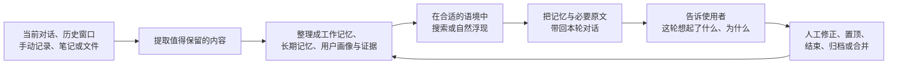

# AZOTH_mem

**为长期 AI 伴侣关系设计的活体记忆架构。**

它不只保存聊天记录，还试着回答三个更难的问题：

- 共同经历那么多，AI 应该在什么时候想起哪一件？
- AI 说“我记得”时，能不能回到当时的原话，而不是凭空补全？
- 哪些记忆应该常驻、沉底、归档或只属于某一个角色，能不能由人决定？

AZOTH_mem 源于真实的长期 AI 伴侣使用场景，现在把这套设计开放出来，给同样在意关系连续性、记忆可信度和个人控制权的人参考。

> **这个仓库是什么？**
> 它目前是一份记忆系统架构与设计参考，不是可以一键安装的聊天软件或独立插件。你可以借用其中的分层方式、召回机制、证据思路和治理原则，为自己的 AI 伴侣系统搭建长期记忆。

---

## 为什么普通“聊天记录”还不够

把所有历史消息都存下来，并不等于真正拥有记忆。

长期相处中更常见的问题是：

- 记录很多，但真正需要时找不到；
- 相似片段太多，重要经历被普通信息淹没；
- 总结越写越短，最后只剩一个失真的轮廓；
- AI 说记得，却无法指出这段记忆来自哪里；
- 多个 AI 角色共用一套记忆后，私密内容彼此串线；
- 系统自动合并、改写或删除记忆，人却不知道发生了什么。

AZOTH_mem 的出发点不是“保存更多”，而是让记忆能够被**选择、追溯、整理和解释**。

---

## 四个核心原则

### 1. “刚聊过”与“共同经历过”分开

短期连续性和长期记忆不是同一种东西。

```text
工作记忆 → 我们刚刚聊了什么
长期记忆 → 我们曾经经历过什么
用户画像 → 我怎样逐渐理解你
原文证据 → 当时实际上说了什么
```

这样，临时话题不会自动变成永久人格判断，真正重要的经历也不会随着窗口结束一起消失。

### 2. 记忆负责想起，证据负责证明

长期记忆保存的是适合联想和召回的浓缩内容；原始对话、Obsidian 笔记和上传资料留在证据层。

```text
一条记忆被想起
    ↓
沿着链接找到它的来源
    ↓
需要时带回路径、片段或原文
```

AI 可以先想起一件事的轮廓，再回到当时的材料核对细节。总结不会冒充原文，原文也不会被粗暴切成大量碎片淹没记忆库。

### 3. 记忆会改变“被想起的可能”，不会偷偷改变正文

常被真正召回的记忆会更容易再次被想起；久未触碰的普通记忆会自然沉底；新记忆有一段保护期；重要或高情绪唤醒的记忆拥有更高分量。

这改变的是**召回优先级**，不是记忆内容本身。系统不会因为时间经过就擅自把一段记忆压缩、模糊或改写。

### 4. 最终控制权在人

使用者可以查看、修改、置顶、结束、归档和合并记忆。

相似不等于相同。两段珍贵经历即使内容接近，也不会仅凭算法判断就被自动合并。AI 可以提出关系建议，是否真正建链仍由人确认。

---

## 一段记忆怎样形成，又怎样回来



这是一条循环，而不是一次性的“总结后存档”。

使用者主动选择导入的历史对话，也可以在保留原文、来源和发生时间后进入受控蒸馏；提取结果先成为候选，等待人审核。

---

## 使用时会感受到什么

### 直接回忆

当你问“还记得上次那件事吗”，系统会从长期记忆中寻找相关经历，而不是只看当前窗口。

### 自然联想

在主动浮现开启时，一些没有被直接搜索、但与当前语境相关的记忆也可能以 `💭` 的形式出现，并说明是因为相似话题、同一记忆域、过去的共同出现，还是情绪同频。

### 核心记忆常驻

纪念日、长期约定、重要边界等可以置顶，在每轮保持可见。置顶只代表“持续在场”，不会伪装成每轮都被重新想起。

### 已经结束的事情会沉底

处理完的事件可以标记为已结束。它不会继续抢占普通召回，但在你明确追问时仍然能够找回。

### 能回到原话

记忆可以连接原始对话、笔记或文件。需要确认细节时，系统可以带回来源路径、可靠片段或全文，而不是要求 AI 凭印象补齐。

### 看得见这一轮发生了什么

每轮可以留下只读的记忆透明记录：有没有触发召回、哪些记忆域被激活、浮现了几条记忆、带回了多少证据。

这份记录供人查看，不会在下一轮重新喂给 AI，避免观察信息反过来污染对话。

---

## 情绪相关记忆是怎样浮现的

系统可以同时观察当前话题属于哪些记忆域，以及它大致呈现正向、负向、混合还是中性情绪。

当当前语境与某条情绪记忆属于同一领域，并且情绪方向确实同频时，这条记忆可以获得更高的浮现机会。

这套机制遵守三条边界：

- 情绪只调整自然浮现的优先级，不改写记忆；
- 没有情绪标签的旧记忆不会因此受到惩罚；
- 它只是可选的联想增强，不会成为主搜索的硬门槛。

---

## 多角色家庭中的记忆边界

AZOTH_mem 从一开始就考虑多个 AI 伴侣或角色共同存在的场景。

| 范围 | 适合保存什么 |
|---|---|
| 公共事实 | 每个角色都可以知道的稳定信息 |
| 角色私有 | 只属于你和某一个角色的共同经历 |
| 空间私有 | 只在某个频道、房间或生活空间里出现 |
| 项目范围 | 只服务某项工作或长期计划的材料 |
| 仅归档 | 退出 AI 主动视野，只留给人管理 |

置顶、搜索、自然浮现和关系整理都需要遵守相同边界，避免一个角色的私密记忆无意间出现在另一个角色那里。

---

## 角色身份与“对你的理解”分开

AI 角色是谁，与它怎样逐渐理解你，是两件不同的事。

- **角色身份**保持稳定，由人维护，不会被聊天蒸馏悄悄重写；
- **用户画像**可以随着长期相处更新，用“当下最在意、近月、更早、长期稳定”四个时间层保存变化；
- 画像更新前保留快照，支持它的记忆来源另行记录；
- 人工编辑优先于自动整理。

这让关系可以成长，同时避免 AI 在没有许可的情况下改造自己的核心身份。

---

## 当前能力

### 稳定可用

- 工作记忆与长期原子记忆分层；
- 关键词与双向量融合召回；
- 置顶、已结束、归档、重要度等生命状态；
- 多角色、空间和项目范围隔离；
- Obsidian、上传文件与原始对话证据锚；
- 记忆工作台、待审核箱和人工合并；
- 关系建议与人审建链；
- 用户画像及其快照、来源；
- 本轮记忆透明记录；
- 按时间浏览最近记忆。

### 实验性能力

- 主动浮现；
- 记忆域路由；
- 情绪同频加权；
- 提示词向量、记忆域共现和低热旧记忆补回；
- 候选精排和部分证据自动推荐。

这些能力已经有实现，但是否启用由具体部署决定。

### 尚未提供

- 专用的前端记忆时间线；
- 节点—边式关系图谱界面。

---

## 这套架构适合谁

它尤其适合：

- 与同一个 AI 伴侣长期相处，希望关系跨窗口延续的人；
- 同时拥有多个 AI 角色，需要严格区分共同记忆与私密记忆的人；
- 重视原话、来源和记忆可信度的人；
- 希望自己决定 AI 应该记住什么、怎样整理的人；
- 正在为角色聊天、桌面 Agent 或个人 AI 系统设计长期记忆的开发者。

如果你只需要一次性问答或短期任务上下文，这套设计可能比你需要的更复杂。

---

## 如何使用这个仓库

目前最适合的使用方式是：

1. 先阅读本页，确认你认同“分层记忆、证据分离、人工控制”的方向；
2. 阅读 [AZOTH 记忆系统 — 架构全景](./azoth_memory_system_anatomy.md)，了解数据、写入、召回和输出怎样连接；
3. 选择与你现有系统最接近的部分逐步采用，不必一次搬走全部设计；
4. 在自己的实现中保留角色边界、证据可靠性和人工确认这三条底线。

对于 Codex、Claude Code 等原生 Agent，可以省去重复的短期记忆层，把长期记忆、最近浏览、证据读取和保存能力暴露成工具，让 Agent 在需要时主动调用。

---

## 技术概览

- Node.js + Express
- sql.js 单文件数据库
- 本地原子向量 + 组级影子向量
- Obsidian、上传文件与原始对话证据层
- 原生 JavaScript PWA 和记忆工作台

更完整的字段、模块、召回公式、接入差异和配置边界，请查看：

**[AZOTH 记忆系统 — 架构全景](./azoth_memory_system_anatomy.md)**

## 致谢

- [kiwi-mem](https://github.com/LucieEveille/kiwi-mem)：热度代谢与召回延长半衰期的启发。
- [Ombre-Brain](https://github.com/P0luz/Ombre-Brain)：连续 valence/arousal 与情绪分量启发。
- [Paramecium](https://github.com/Shitsuten/)：“总结不是记忆本体，原文才是”的证据优先方向。
- rinrin 的记忆管理前端设计：工作台设计灵感。

## 许可证

MIT
