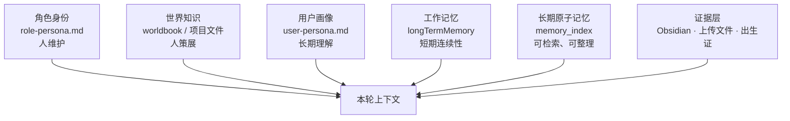
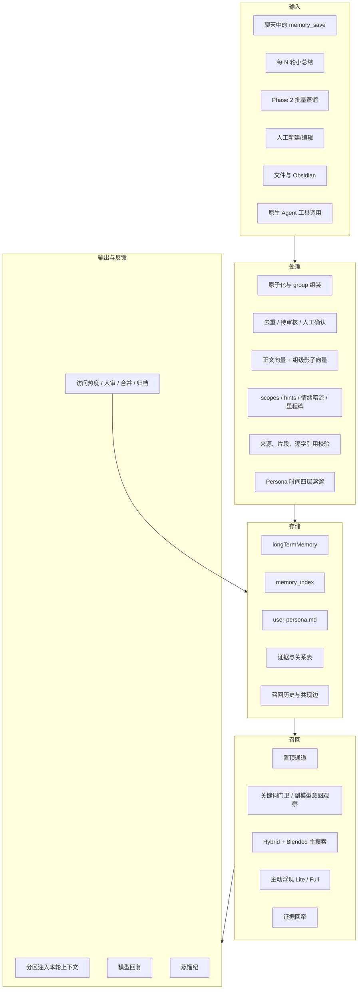
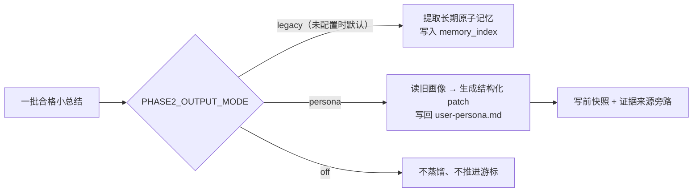
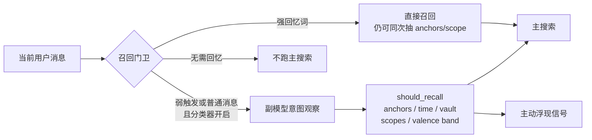
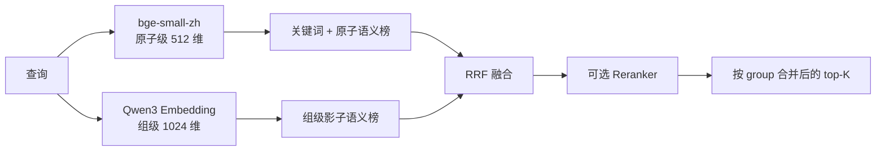

# AZOTH 记忆系统 — 架构全景

> **文档版本：v6.0 · 2026-07-19**
>
> **核验范围：** AZOTH 当前本地主线的写入、存储、召回、浮现、证据、注入、透明度与人工治理链。
> **状态词约定：** “已实现”只代表代码与回归存在；“已运行”才代表默认链会使用；“灰度”表示还受开关或入口限制。

---

## 0. 先给结论

AZOTH 的记忆系统已经不是一条“向量搜索 → 塞进 prompt”的直线，而是一套完整闭环：

1. 从对话、工具、文件和人工操作接收材料；
2. 把短期连续性、长期原子记忆、用户画像和原文证据分层保存；
3. 通过触发器、置顶、混合检索和主动浮现决定本轮想起什么；
4. 把记忆、浮现理由与原文证据分区注入；
5. 用“蒸馏纪”向人解释本轮召回；
6. 再由访问热度、人审、合并、归档和画像蒸馏持续整理。

旧文档里最需要纠正的判断是：

- **Scope 与当前情绪极性已经由同一次副模型观察产出。**
- **情绪同频浮现已经实现，但只在主动浮现侧、且受多重开关和入口限制。**
- **主搜索不使用 scope 或当前情绪极性做排序或硬过滤。**
- **Enso 不是记忆系统；Dream 整合和记忆软化没有实现，也不是当前下一阶段。**
- **已有时间浏览工具和关系边，但没有前端时间线或关系图谱画布。**

---

## 1. 认知分层



### 1.1 角色身份

`role-persona.md` 回答“我是谁、怎样行动”。这是角色的稳定核心，由人维护，记忆蒸馏不会自行重写它。

### 1.2 用户画像

`user-persona.md` 回答“我怎样长期理解这个用户”。当前结构是四层时间叙事：

- 当下最在意；
- 近月变化；
- 更早阶段；
- 长期稳定。

当 `PHASE2_OUTPUT_MODE=persona` 时，Phase 2 会把一批合格小总结蒸馏进这份画像。写回前会留快照，支持画像正文的记忆组证据单独存在旁路表里；人工编辑优先。

### 1.3 工作记忆

`longTermMemory` 保存近期小总结，主要解决窗口内和跨窗口的短期连续性。它不是向量长期库，也不承担证据证明。

### 1.4 长期原子记忆

`memory_index` 保存可以被检索、置顶、沉底、归档、合并和链接的原子记忆。相关原子用 `group_id` 组成一组；召回后通常以组为单位还原完整语义。

### 1.5 证据层

Obsidian 文档、上传文件、原始对话窗口和逐字引用验证回答“这条记忆从哪里来、原话是什么”。证据可以被牵回，但不会冒充长期记忆正文。

---

## 2. 端到端总图



---

## 3. 输入与写入

### 3.1 写入入口

| 入口 | 进入哪里 | 是否自动 |
|---|---|---|
| `memory_save` | `memory_index` | 模型主动调用 |
| 每 N 轮小总结 | `longTermMemory`，并可同步长期索引 | 自动，取决于聊天设置 |
| Phase 2 legacy | 从一批小总结提取长期原子记忆 | 自动，模式开关决定 |
| Phase 2 persona | 更新 `user-persona.md`，不再追加画像碎片 | 自动，模式开关决定 |
| 记忆工作台手写 | `memory_index` | 人工 |
| 文件蒸馏 | `memory_staging`，批准后进入长期库 | 人审 |
| Obsidian / 上传文件 | 证据层，可再与记忆建链 | 扫描或人工 |
| 共读与专用侧路 | 长期记忆或项目/文件知识层 | 按各自入口 |

自动写入不是所有聊天表面无条件常驻：角色聊天的小总结还要满足自动总结开关、轮次阈值和可用副模型；同步长期索引还会经过重要度门槛。`memory_save` 的写链和工具定义已经存在，但模型侧能否调用仍受能力挂载与权限策略控制。

### 3.2 写入咽喉

长期原子记忆的主写入链负责：

- 统一用户、角色、空间和项目归属；
- 正规化 importance、valence、arousal 和扩展元数据；
- 生成或保留 `group_id`；
- 做写入去重；
- 生成本地正文向量；
- 在需要时更新组级影子向量和提示向量；
- 保留来源与人工状态。

不是所有入口都天然产出相同元数据：

- `memory_save` 可显式写入数值 valence/arousal；
- 当前 Phase 2 重点产出 `scopes`、`recall_hints`、`save_reason`、`emotional_undercurrent` 与 `undercurrent_polarity`；
- Phase 2 并不会自动补齐数值 valence/arousal；
- 历史记忆缺少新字段时按中性和不惩罚原则兼容，不能因为旧数据没有 scope 就失去召回资格。

### 3.3 Phase 2 的两种输出



Persona 模式的重要护栏：

- 旧格式无法安全识别时暂停，不吞材料；
- 临时失败保留游标，后续重试；
- 写前保存快照；
- 人工编辑优先；
- 画像证据锚不混进正文；
- 更新后使相关提示缓存失效。

---

## 4. 存储结构

### 4.1 核心记忆

| 载体 | 职责 |
|---|---|
| `memory_tables` | 工作记忆和旧兼容数据容器 |
| `memory_index` | 原子长期记忆、向量、状态、归属与元数据 |
| `memory_group_embeddings` | Qwen3 组级影子向量 |
| `memory_hint_embeddings` | `recall_hints` 的独立影子向量 |
| `memory_scope_cooccurrence` | 每用户 scope 共现快照 |

`memory_index` 的关键字段分为五组：

| 类别 | 关键字段 |
|---|---|
| 所有权 | `user_id`、`character_id`、`space_key`、`project_id` |
| 内容 | `content`、`group_id`、`timestamp`、`source_type` |
| 召回 | `embedding`、`importance`、`last_accessed_at`、`activation_count` |
| 生命状态 | `pinned`、`resolved_at`、`visibility` |
| 情绪与语义 | `valence`、`arousal`、`meta_json` |

当前本地主向量为 bge-small-zh-v1.5 **512 维**。Qwen3 组级与提示影子向量为 **1024 维**。不同模型、提供方、维度和版本分桶保存，不混算。

### 4.2 关系与人审

| 载体 | 职责 |
|---|---|
| `memory_links` | 记忆组、文档、来源之间的稳定边 |
| `memory_link_suggestions` | 模型提出的关系建议，人审后才建真边 |
| `memory_staging` | 文件蒸馏等候选的待审核箱 |

合并与建链遵守“人最终确认”：

- 模型可以建议关系，不能自行批准；
- 相似记忆不会自动合并；
- `merged_into` 等维护关系不暴露给模型；
- 组重建时保留状态和扩展元数据。

### 4.3 证据

| 载体 | 职责 |
|---|---|
| `obsidian_documents` | 文档稳定身份、当前位置、内容和失联状态 |
| `source_contexts` | 记忆诞生于哪段对话的“出生证” |
| `source_chunks` | 带字符坐标、标题路径和内容哈希的证据片段 |
| `source_chunk_embeddings` | 文档片段的多模型影子向量 |

证据与记忆正文分离。文档移动或改名不改变稳定身份；原文变化时可标记 stale/drifted，而不是继续假装旧片段仍可靠。

### 4.4 浮现历史

| 载体 | 职责 |
|---|---|
| `memory_recall_context` | 记录某条记忆曾在什么查询语境被召回 |
| `memory_co_recall` | 记录多条记忆同场被想起形成的行为边 |

这些表帮助主动浮现产生“上次聊这个话题时还想起了什么”和“哪些记忆经常一起出现”的信号。它们不是前端关系图谱。

### 4.5 用户画像的旁路数据

`persona-distiller` 另外维护：

- `user_persona_snapshots`：画像写回前的快照；
- `user_persona_provenance`：各时间层由哪些记忆组支持、是否因人工编辑变旧。

画像正文仍在角色包内的 `user-persona.md`，数据库只保存快照和证据锚。

---

## 5. 所有权与可见性

### 5.1 角色与共享

当前共享池规范不是字符串 `shared`：

```text
角色私有：character_id = 当前角色
公共事实：character_id IS NULL
          且 visibility = shared_public_fact
```

只有公共事实可以跨角色/空间自然放行。空角色归属并不自动等于“所有人可见”，还要通过 visibility 检查。

### 5.2 可见性

| 值 | 行为 |
|---|---|
| `shared_public_fact` | 可按公共事实规则跨上下文使用 |
| `private_character` | 只属于对应角色 |
| `private_space` | 还要满足具体空间 |
| `archive_only` | 退出 AI 主动视野，只在人类管理面可见 |

### 5.3 项目边界

项目记忆带 `project_id`。项目内检索优先本项目；未进入项目的普通聊天会排除项目私有行，避免项目材料泄到无关对话。

---

## 6. 召回决策

### 6.1 LifeOS 网页聊天

LifeOS 的自动召回链是：



同一次副模型观察可产出：

- 是否需要召回；
- 召回意图；
- 主题锚词、时间和 vault 提示；
- 1–3 个 `memory_scopes`；
- 当前 `memory_valence_band`；
- 关系权重、脆弱信号、语境模式等观察字段。

输出会经过白名单和失败关闭处理。它是意图观察器，不是主搜索引擎。

### 6.2 Discord

Discord 使用 contextual search，结合语义、空间、参与者、重要度和召回策略。当前它无条件进入这条召回链，不走 LifeOS 同一套副模型意图观察。

因此即使主动浮现相关环境开关都打开，Discord 当前传给浮现层的仍是：

```text
memoryScopes = []
memoryValenceBand = neutral
```

Discord 主召回正常；scope 与当前情绪极性路由尚未接通。

### 6.3 模型主动调用记忆工具

公开的 `memory_search` / `memory_hybrid_search` 参数目前没有 `memory_scopes` 或当前 `memory_valence_band`，执行前也不会调用副模型。

所以原生 Agent 工具链可以保存、搜索、最近浏览和回看证据，但当前 **scope/情绪观察不会参与该次工具召回**。

---

## 7. 主搜索

### 7.1 默认 Blended 双车道



默认召回引擎是 `blended`。两条车道各自排名后用 RRF 融合，避免把不同模型的原始相似度硬比较。Qwen 失败时可以退回本地车道。

### 7.2 默认评分与 v2

单车道默认 v1 质量分为：

```text
关键词 0.3 + 向量语义 0.4 + 重要度 0.2 + 新鲜度 0.1
```

当 `memoryScoringV2=true`：

```text
关键词 0.3 + 向量语义 0.4 + 长期分量 0.2 + 短期热度 0.1
```

其中：

```text
heat = initialTemp × 2^(-days / halfLife) + recallBonus
halfLife = 7天 × (1 + activationCount × 0.3)
longTermWeight = importance × (0.7 + 0.6 × arousal)
```

关键边界：

- `resolved_at` 在普通查询中沉底，显式回忆可减免；
- `archive_only` 不进入 AI 召回；
- 置顶行在普通评分前排除，避免“每轮在场”刷高 activation；
- scope 和当前情绪极性**不进入这套主公式**；
- arousal 只有在评分 v2 或主动浮现中才真实影响排序；
- valence 不参与主搜索。

---

## 8. 主动浮现

主动浮现让记忆在没有直接命中主搜索时也可能自然冒出来，但它不是默认常开功能。

### 8.1 两层结构

| 层 | 什么时候跑 | 候选信号 |
|---|---|---|
| Lite | 每轮，在浮现总开关打开时 | 高热、冷启动、当前消息语义 |
| Full | 主搜索触发后 | 余味、召回语境、共召回边、锚词、scope、提示向量、整库冷候选 |

### 8.2 Scope 路由

记忆元数据可以携带多个 scopes。当前消息的意图 scopes 与候选记忆相交时：

- 第一意图域命中可获得更高的正向乘数；
- 其他意图域命中获得较小正向乘数；
- 不匹配不受惩罚；
- 整库冷候选通道可补入低热但同域的旧记忆；
- `recall_hints` 既可做文本提示，也可有独立影子向量；
- scope 共现快照可帮助跨域联想；
- 多候选还会做多样性控制，避免单域垄断。

这保证了新元数据增强召回，但不会伤害没有标签的历史记忆。

### 8.3 情绪同频

情绪调节浮现已经实现，条件是：

1. 主动浮现打开；
2. scope 路由打开；
3. 当前意图包含 emotion；
4. 候选记忆也包含 emotion；
5. 情绪暗流开关打开；
6. 当前消息与候选记忆的正/负极性一致。

满足时，候选获得 `+0.08` 的情绪同频加权，并在注入理由中显示“情绪同频”。

候选极性优先读取 `undercurrent_polarity`；缺失时可从数值 valence 退化推断。当前只对 positive/negative 明确同频加分，mixed/neutral 不会硬凑。

这不是情绪记忆改写，也不是长期情绪曲线；它只改变候选浮现优先级。

### 8.4 注入理由

浮现记忆以独立格式进入上下文，例如：

```text
💭 [记忆内容] [余味 / 相似话题 / 行为共振 / 同域 / 场景匹配 / 情绪同频]
```

这样模型和人都能区分“主搜索找到的记忆”和“系统主动联想到的记忆”。

---

## 9. 证据回牵

### 9.1 三档注入

| 档位 | 行为 |
|---|---|
| `path` | 只给文档路径与标题，需要时再读 |
| `snippet` | 注入人工选择或可靠定位的片段 |
| `full` | 注入存档全文，适合少量重要材料 |

默认以路径为主，避免把整篇文档长期塞入上下文。

### 9.2 证据可靠性

- 出生证记录源对话范围和参与者；
- 文档片段记录字符坐标、标题路径和内容哈希；
- 原文变化时标记 stale/drifted/missing；
- `evidence_quote` 必须能在原文中逐字找到，才能标记 verified；
- 记忆命中后，相关证据由搜索返回层统一附着，网页自动注入、Discord 和工具消费方可以共享同一结果结构。

---

## 10. 输出与蒸馏纪

### 10.1 提示词分区

典型 LifeOS 链会把以下内容分区加入本轮上下文：

```text
角色身份 / 世界知识
用户画像
工作记忆
置顶记忆
本轮主召回
主动浮现
Obsidian / 文件原文证据
```

普通召回、置顶、浮现和证据不是同一来源，也不应混成一段无法解释的文本。

### 10.2 蒸馏纪

本轮回复完成时会生成只读快照，包含：

- 意图观察是否运行、耗时与状态；
- 是否触发召回；
- 使用的召回引擎；
- 被激活的 scope 及贡献；
- 主召回、Full/Lite 浮现数量；
- 浮现原因；
- 证据和推荐片段数量；
- 本轮上下文模式。

快照挂在本轮消息 metadata 中供界面查看。发送下一轮给模型前会剥离，不把观察数据循环污染上下文。

### 10.3 v3 live 的额外边界

v3 live 上下文编译目前默认关闭。开启后普通召回仍可由编译器保留，但置顶、主动浮现等额外动态段还受 `LIFEOS_V3_LIVE_RESTORE_DYNAMIC_INJECTION` 控制。该恢复开关默认关闭，因此不能把 v3 live 与普通注入链视为完全等价。

---

## 11. 生命周期：热度不是软化

### 11.1 当前真实机制

```text
pinned       = 是否走稳定在场通道
resolved_at  = 事情是否结束
visibility   = 谁能看、AI 是否还能主动看
importance   = 这件事本身多重要
heat         = 最近是不是容易被想起
```

这些维度彼此正交。一条记忆可以既 resolved 又重要，也可以 pinned 但只对某个角色可见。

### 11.2 不自动删除、不自动模糊正文

当前热度只影响召回难易：

- 时间会让普通记忆的短期热度下降；
- 真正召回会增加 activation 并延长半衰期；
- 新记忆有冷启动保护；
- 人可以置顶、取消置顶、标记 resolved、归档或合并；
- 系统不会因为热度下降就改写正文、删减细节或把 resolution 从 1.0 降到 0.5。

因此：

> **热度衰减 ≠ 记忆软化。**

---

## 12. 人类管理面

记忆工作台当前提供：

- 分页、筛选和搜索；
- 详情抽屉；
- 正文、重要度、情绪与扩展元数据编辑；
- 置顶、resolved、归档；
- 来源、证据和关系列表；
- 待审核箱；
- 相似组整理与人工合并；
- 手动新建和文件导入；
- 用户画像阅读与来源透明度入口。

### 12.1 时间浏览

工具层已有 `memory_recent` 等按时间倒序和相对日期浏览能力，并做组级合并。当前没有专用的前端时间线视图。

### 12.2 关系浏览

数据层已有 `memory_links`、关系建议、人审建链和详情抽屉中的关系列表。当前没有节点—边式交互图谱画布。

---

## 13. 开关与默认态

| 能力 | 控制 | 未配置/新用户默认 | 说明 |
|---|---|---|---|
| 主召回引擎 | `MEMORY_RECALL_ENGINE` | `blended` | 非法值退回安全模式 |
| 副模型意图观察 | PWA `autoMemoryIntentClassifier` | OFF | 主动浮现开启时服务端会需要它，但前端明确值仍重要 |
| 召回评分 v2 | PWA `memoryScoringV2` | OFF | 打开后 arousal 进入热度/长期分量 |
| 主动浮现 | PWA `memorySurfacing` + `MEMORY_SURFACING` | PWA 明确 OFF | 前端显式 false 会压过服务端环境值 |
| Scope 路由 | `MEMORY_SURFACING_SCOPE_ROUTE` | OFF | 只增强浮现侧 |
| 情绪暗流 | `MEMORY_SURFACING_UNDERCURRENT` | OFF | 还要求 emotion scope |
| Hint 向量 | `MEMORY_SURFACING_HINT_EMBED` | OFF | 独立影子向量 |
| Scope 共现 | `MEMORY_SURFACING_COOCCURRENCE_AUTO` | OFF | 每用户动态共现 |
| 随机漂移 | `MEMORY_SURFACING_DRIFT` | OFF | 稀疏场景随机旧记忆 |
| Reranker | `MEMORY_RERANKER` / 请求配置 | OFF | 候选精排 |
| Phase 2 输出 | `PHASE2_OUTPUT_MODE` | `legacy` | 可设 persona / legacy / off |
| v3 live | `LIFEOS_V3_LIVE` | OFF | 新上下文编译链 |
| v3 live 动态补回 | `LIFEOS_V3_LIVE_RESTORE_DYNAMIC_INJECTION` | OFF | 控制置顶/浮现等额外段 |

这张表描述的是代码默认，不代表某台线上机器当前实际环境值。要证明生产启用状态，必须另查运行配置与真实请求轨迹。

---

## 14. 三条消费链的真实差异

| 能力 | LifeOS 自动链 | Discord 自动链 | 原生 Agent 工具链 |
|---|---|---|---|
| 主搜索 | 有 | 有，走 contextual | 有 |
| 副模型判断是否召回 | 可选 | 不走同一门卫 | 不走 |
| 当前 scope | 可产出 | 当前为空 | 公共工具参数无入口 |
| 当前情绪极性 | 可产出 | 当前为 neutral | 公共工具参数无入口 |
| Scope/情绪进入主搜索 | 否 | 否 | 否 |
| Scope/情绪增强主动浮现 | 开关齐全时可以 | 当前没有有效输入 | 当前没有有效输入 |
| 证据锚 | 有 | 有 | 搜索结果可携带 |
| 蒸馏纪 | 有 | 有限/按聊天主路 | 无 PWA 界面 |

因此“scope 与情绪识别已经做了”是真话；“它已贯穿所有入口”是假话。

---

## 15. 旧提案清退

### 15.1 记忆软化

**状态：未实现，未排期。**

旧提案里的 resolution 1.0→0.5→0.3 指正文逐渐失去分辨率。当前系统没有这类字段、改写任务或压缩器。现有热度系统已经能让记忆逐渐不易被想起，同时保留原文完整性。

处理：不再写成“下一阶段”；只在未来出现明确产品缺口时重新评估。

### 15.2 Enso

**状态：声明态，`executable=false`。**

现有 Enso 代码提供 Guard / Trace / Lessons 的声明、只读接口和控制台展示，但不评估请求、不阻止或允许工具、不写执行轨迹、不生成 lessons。

它面向插件/工具执行治理，不属于记忆写入、召回或证据链。旧文档把它描述成“保护人类真实记忆”的记忆层是不准确的。

处理：从本记忆架构和路线图移除，单独放入工具治理文档。

### 15.3 Dream / 月度整合

**状态：未实现，当前不计划。**

仓库里没有凌晨定时 consolidation、矛盾消解、模式提炼或月度记忆重写任务。角色包里的 `dreaming` skill 是可选的日记/叙事技能，不是后台记忆整合器。

处理：从当前路线图移除。

### 15.4 时间线 / 关系图谱

**状态：底座部分存在，可视化未实现，未排期。**

- 时间浏览：`memory_recent` 等工具已存在；
- 关系底座：关系表、建议箱、人审和关系列表已存在；
- 未实现：前端记忆时间线、节点—边图谱交互。

处理：不把底座说成零，也不把底座说成 UI 已完成。

### 15.5 情绪调节浮现

**状态：已实现但默认关闭，并且入口不统一。**

同一次副模型观察已能产出 scope 与当前情绪极性；主动浮现已能识别候选的情绪暗流并做同频加权。它不进入主搜索，Discord 与工具链当前没有有效输入。

处理：从“未来设想”移入“灰度召回增强”。

---

## 16. 模块地图

### 16.1 核心服务

| 模块 | 职责 |
|---|---|
| `services/memory-records.js` | 记忆 CRUD、状态、关系、合并和所有权 |
| `tools/memory.js` | `memory_save` 与长期写入 |
| `tools/memory-search.js` | Hybrid/Blended/contextual 主召回、置顶、证据附着 |
| `services/memory-surfacing.js` | Lite/Full 浮现、scope、hint、情绪暗流和多样性 |
| `services/memory-injection-format.js` | 主召回、浮现与证据的注入格式 |
| `services/phase2-extractor.js` | Phase 2 结构化元数据提取 |
| `services/persona-distiller.js` | `user-persona.md` 四层画像蒸馏 |
| `services/turn-snapshot.js` | 蒸馏纪快照 |
| `services/memory-group-embeddings.js` | Qwen3 组级影子向量 |
| `services/memory-hint-embeddings.js` | recall hints 影子向量 |
| `services/memory-scope-cooccurrence.js` | scope 共现快照 |
| `services/source-context.js` | 对话出生证 |
| `services/source-chunks.js` | 文档片段证据 |
| `services/evidence-quote.js` | 逐字引用验证 |
| `services/memory-link-suggestions.js` | 关系建议与人审 |

### 16.2 路由与界面

| 模块 | 职责 |
|---|---|
| `routes/ai.js` | 聊天主链、意图观察、召回、注入、Phase 2、蒸馏纪 |
| `routes/memory-index.js` | 记忆列表、搜索、编辑、关系与合并 API |
| `routes/memory-staging.js` | 待审核批准/拒绝 |
| `routes/memory-chain.js` | 对话链和小总结 |
| `routes/obsidian-docs.js` | Obsidian 文档索引 |
| `memory-desk.js` | 记忆工作台 |
| `turn-transparency.js` | 蒸馏纪界面 |

---

## 17. 已知边界

当前仍需要明确保留的边界：

1. Scope 与情绪只增强主动浮现，不进入主搜索。
2. PWA 默认把意图分类、评分 v2 和主动浮现关掉；“代码上线”不等于“每轮生效”。
3. Discord 没有接通副模型 scope/价态输入。
4. 原生 Agent 的公开搜索工具没有 scope/当前价态参数。
5. Phase 2 persona 已实现，但未配置时仍默认 legacy。
6. v3 live 的额外动态注入还需要独立恢复开关。
7. 时间浏览和关系数据已有底座，但没有专用时间线/图谱 UI。
8. Enso、Dream 整合和记忆软化不属于当前记忆主线。
9. 线上开关状态必须用生产配置与真实请求轨迹另行证明，不能从代码存在反推。

---

## 18. 验证口径

架构文档不再保存“某次机器有多少组记忆”“某个文件有多少 KB”这类会快速过期的数字。

验证分三层：

1. **静态追链**：从入口一直追到存储、召回、注入和输出；
2. **专项回归**：scope、浮现、状态、画像、蒸馏纪、时间浏览等分别实跑；
3. **生产证明**：需要部署环境开关、真实请求轨迹与前端请求值，不能由本地 smoke 代替。

截至 2026-07-19，本次重写已核实：

- scope、整库冷候选与情绪同频的专项回归通过；
- 时间浏览工具专项回归通过；
- Enso 边界检查确认其仍为不可执行声明态；
- 热度代码只改变召回排序，没有正文软化链；
- 文档不把本地代码通过误写成生产环境已经打开；
- Phase 2、蒸馏纪、记忆状态和主动浮现共 382 条显式断言通过；访问衰减另有一条过时的静态计数检查失败，实际调用链未漏接，因此本次没有把“全套测试全绿”写进结论。

---

> **当前主线总结：** AZOTH 已经形成“输入材料 → 分层蒸馏 → 长期存储 → 主召回/主动浮现 → 证据回牵 → 分区注入 → 蒸馏纪 → 人工整理”的完整记忆闭环。下一步若继续建设，应优先补齐入口一致性和灰度可观测性，而不是把 Enso、Dream 或记忆软化重新塞回记忆路线图。
