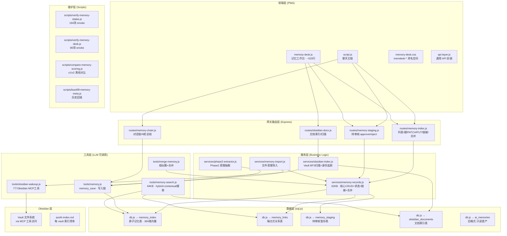
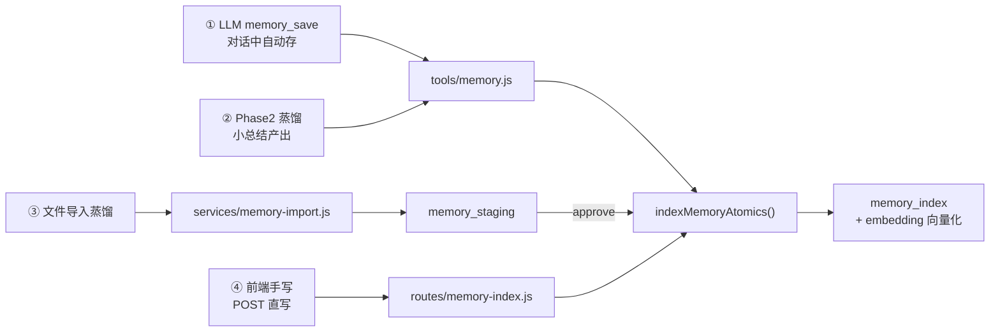
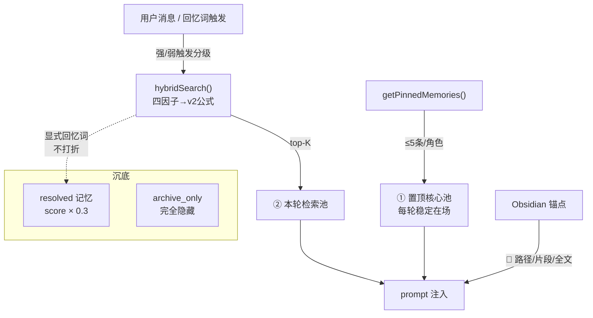

# AZOTH 记忆系统 — 架构全景

> AZOTH 记忆子系统的完整架构参考文档。

---

## 0. 一句话定位

AZOTH 的记忆不是"搜得到的旧东西"——它是**有生命状态的长期心智**。有些永远在场（置顶），有些会热起来（浮现），有些会沉底（已解决），有些能回到原文（Obsidian 证据），有些会被整理合并（去重）。

**多角色原生**：AZOTH 从第一天起就为多个 AI 角色共存的"多机之家"设计——每个角色有独立的记忆空间、独立的 Obsidian vault 绑定、独立的置顶池，同时支持跨角色共享的公共事实层。一对一也能用，但架构天然支持你家有很多位小机。

---

## 1. 架构总览



---

## 2. 数据模型

### 2.1 memory_index — 原子记忆表（核心）

> `server/db.js`

| 字段 | 类型 | 语义 |
|------|------|------|
| id | INTEGER PK | — |
| user_id | TEXT | 用户 |
| character_id | TEXT | 角色（或 `shared` 共享池） |
| content | TEXT | 记忆正文（浓缩） |
| embedding | TEXT | 384维 bge-small-zh 向量（JSON） |
| importance | REAL [0,1] | 长期重要度（手调或写入时定） |
| group_id | TEXT | 组 ID（N轮总结等多原子组） |
| space_key | TEXT | 空间键（多端隔离用） |
| visibility | TEXT | `shared_public_fact` / `private_character` / `private_space` / `archive_only` |
| source_type | TEXT | `llm_tool` / `phase2_distill` / `auto_summary` / `manual` / ... |
| **pinned** | INTEGER 0/1 | 置顶（独立通道，不参与衰减） |
| **resolved_at** | TEXT NULL | 已解决时间（NULL=未解决） |
| **activation_count** | INTEGER | 被想起次数（每次召回+1，置顶在场不计） |
| **valence** | REAL [0,1] NULL | 情绪效价（NULL=未标注→0.5兜底） |
| **arousal** | REAL [0,1] NULL | 情绪唤醒度 |
| **meta_json** | TEXT NULL | 蒸馏元数据 JSON（scope/emotionTag/entities/pending/reason） |
| last_accessed_at | TEXT | 最近被想起时间 |
| timestamp | TEXT | 创建时间 |

**多角色隔离**：`character_id` 决定一条记忆属于哪个角色。检索时按角色过滤，角色 A 的私有记忆不会出现在角色 B 的召回结果里。`shared` 池是全家共享的公共事实（比如"主人讨厌香菜"），所有角色都能检索到。`visibility` 四档进一步控制可见范围——`private_space` 的记忆只在特定空间（如某个 Discord 频道）可见。

### 2.2 memory_links — 关系表

| 字段 | 语义 |
|------|------|
| left_kind | `memory_index_row` / `memory_index_group` / `ai_memory` |
| left_key | 左端 ID |
| right_kind | 同上 + `obsidian_doc` |
| right_key | 右端 ID |
| relation_type | `related` / `prerequisite` / `contradicts` / `merged_into` |
| meta_json | `{injectMode, snippet}` 注入模式配置 |

### 2.3 obsidian_documents — 文档索引表

| 字段 | 语义 |
|------|------|
| id (= azoth_doc_id) | 稳定身份，不随改名变 |
| vault_key (= serverId) | MCP 服务稳定 ID |
| vault_name | 显示名（可改不断链） |
| path | 当前路径（移动时更新） |
| title | 文件标题 |
| content_hash | 内容指纹（变动检测） |
| content_text | 正文存档（≤60000字，full 档数据源） |
| doc_type | `daily` / `reference` / `evidence` / `upload` |
| status | `active` / `missing`（失联标状态不删行） |
| id_written | frontmatter 是否写回 |

**每角色独立 vault**：每个角色可以绑定自己的 Obsidian vault（通过 MCP 服务），扫描索引和证据关联都是角色级别的。角色 A 的 vault 里的笔记不会被角色 B 的记忆关联到。

### 2.4 memory_staging — 待审核表

蒸馏/Phase2 产出 → 进 staging → 工作台人审 approve/reject → 通过后进 memory_index。

---

## 3. 核心数据流

### 3.1 记忆写入（四条路）



**关键**：四条写入路都经过 `indexMemoryAtomics()`，**valence/arousal/meta_json 全套透传**。

### 3.2 记忆召回（三个池 + 一个通道）



**多角色置顶隔离**：每个角色有独立的置顶池（≤5 条/角色），互不干扰。角色 A 置顶的"我们的纪念日"不会出现在角色 B 的 prompt 里。空间可见性在置顶通道同样生效——space B 的私有置顶不会泄进 space A。

### 3.3 召回公式 v2（灰度开关 `memoryScoringV2`）

```
召回分 = 语义相关度 × 0.7
       + 长期权重 × W_long     ← importance × arousal增益(0.7~1.3)
       + 短期热度 × W_heat     ← 指数衰减 × activation_count^0.3 × diversity
       + 空间/角色匹配
       - resolved 沉底惩罚(×0.3, 强回忆词减免)
```

**热度公式（借鉴 kiwi-mem + Ombre-Brain）**：
```
initialTemp = min(1, 0.3 + max(importance, arousal) × 0.7)
halfLife    = baseHalfLife × (1 + activationCount × 0.3)  // 越常想起越不易忘
decay       = 2^(-daysSinceAccess / halfLife)
recallBonus = min(0.2, activationCount × 0.02)
heat        = initialTemp × decay + recallBonus
// 冷启动保护：activationCount=0 时 30天内保底 0.3+importance×0.5
```

---

## 4. 文件清单 × 职责

### 4.1 后端 — 服务层

| 文件 | 大小 | 职责 |
|------|------|------|
| `services/memory-records.js` | 62KB | **核心**：CRUD / patchMemoryState / updateMemory(重向量化) / memory_links CRUD / mergeMemories / group重建保留状态 |
| `services/memory-import.js` | 8KB | 文件蒸馏（副模型抽≤5条候选→staging） |
| `services/obsidian-index.js` | 25KB | Vault BFS扫描 / azoth_doc_id 身份追踪 / 失联检测 / 旧格式兼容门 |
| `services/phase2-extractor.js` | 8KB | Phase2 蒸馏元数据抽取 |
| `services/wakeup-heat.js` | 12KB | wakeup 路径的热度系统 |

### 4.2 后端 — 工具层（LLM 可调用）

| 文件 | 大小 | 职责 |
|------|------|------|
| `tools/memory.js` | 33KB | `memory_save` 工具：写入链（含 valence/arousal/meta 透传）+ Jaccard 75% 写入去重 |
| `tools/memory-search.js` | 64KB | `memory_search` / `memory_recall`：hybrid 四因子→v2 + contextual 搜索 + heatScore + 置顶通道 + resolved 惩罚 + Obsidian 锚点携带 + 检索去重 |
| `tools/merge-memory.js` | 9KB | 相似簇发现 + 合并端点 |
| `tools/obsidian-wakeup.js` | 15KB | 7个 Obsidian MCP 工具（3读4写）+ 角色 vault 绑定 |

### 4.3 后端 — 路由层

| 文件 | 大小 | 职责 |
|------|------|------|
| `routes/memory-index.js` | 40KB | 完整 REST：列表/搜索/分页/stats / PATCH(6字段) / PUT content(重向量化) / GET links / POST links / DELETE links / PATCH links(注入模式) / similar-groups / merge / POST直写 |
| `routes/memory-staging.js` | 7KB | staging approve/reject + 批量清积压 |
| `routes/memory-chain.js` | 14KB | N轮对话链 + 小总结 auto_summary |
| `routes/obsidian-docs.js` | 3KB | Obsidian 文档索引 REST |
| `routes/ai.js` | 431KB | **聊天主路由**：记忆注入拼装（置顶段 + 检索段 + 锚点段） |

### 4.4 前端

| 文件 | 大小 | 职责 |
|------|------|------|
| `memory-desk.js` | 62KB | **记忆工作台**：详情抽屉(编辑/状态/情绪/链接/元数据) + staging审核箱 + 相似整理面板 + 手动新建 + 文件导入 + 注入模式开关 |
| `memory-desk.css` | 11KB | 工作台样式，`memdesk-` 前缀隔离 |
| `script.js` | 2.3MB | 巨石主体，记忆索引列表页（mi-系列）在此 |

### 4.5 维护/验证脚本

| 文件 | 项数 | 职责 |
|------|------|------|
| `scripts/verify-memory-states.js` | **194项** | 全字段/全路径 smoke 测试 |
| `scripts/verify-memory-desk.js` | **86项** | 前端工作台接线 smoke |
| `scripts/verify-memory-records.js` | — | 基础 CRUD 回归 |
| `scripts/verify-memory-runtime-tools.js` | — | 运行时工具集成回归 |
| `scripts/compare-memory-scoring.js` | — | v1/v2 公式离线对比 |
| `scripts/backfill-memory-meta.js` | — | 历史 auto_summary 元数据回填 |

---

## 5. 施工状态

| 阶段 | 名称 | 状态 | 核心产出 |
|----|------|------|----------|
| **1** | 记忆状态字段 + API + link 扩展 | ✅ 已上线 | 5新字段 + patchMemoryState + link新kind/relation |
| **2** | PWA 记忆工作台 | ✅ 已上线 | memory-desk.js/css + staging审核箱 + 批量归档 |
| **2.5** | 蒸馏元数据透明化 | ✅ 已上线 | meta_json 列 + 四条写入路全通 |
| **3** | 热度系统 + 召回公式v2 + 置顶通道 | ✅ 已上线 | heatScore + 灰度toggle + getPinnedMemories |
| **4** | 相似记忆合并工作台 | ✅ 已上线 | findSimilarClusters + mergeMemories + 工作台面板 |
| **5** | Obsidian 文档索引第一期 | ✅ 已上线 | obsidian_documents表 + BFS扫描 + 身份追踪 + 召回联动 |
| **6** | 手动记忆 + 文件导入 | ✅ 已上线 | 蒸馏导入 + 整篇直存 + 上传进证据层 |
| **7A** | 注入模式开关 + 手动片段锚点 | ✅ 已上线 | path/snippet/full 三档 + content_text存档 |

---

## 6. 备选池（未排期）

> 排序：**8-a → 7B → 8-b → 8-c**

### 8-a：逐字引用证据（最小刀，优先）
蒸馏候选加 `evidence_quote` — 一句原文逐字引用，**机械校验引用真出现在原文里**，找不到整条扔。审核箱显示"证据句"。防转述漂移，零额外 LLM 成本。

### 7B：原文层证据链
- **第一步**：`source_chunks` + `memory_evidence_links`（组→文档→片段三层锚定），7A 的 snippet 升级成有稳定身份的 chunk 锚点
- **第二步**：整库 chunk 向量检索（"不知道哪篇相关让系统自己找段落"）

### 8-b：memory_link 关系建议箱
角色提"A 和 B 可能 related，理由是…" → 建议箱（复用 staging 审核箱的心智模型）→ 人审通过才真建链。`merged_into` 永不暴露给 AI。

### 8-c：recall 行为信号三件套
把角色真实行为变成检索信号，零 LLM 抽取——
1. **回复的余味**：角色回复 embed 当下一轮检索 query
2. **召回上下文**：recall 日志挂"当时聊到哪"的向量（"雨夜想起过的话下一个雨夜更近"）
3. **行为边**：同场对话先后 recall 的记忆自动连边

---

## 7. 架构特色与设计哲学

### 7.1 多角色原生架构

AZOTH 不是"单角色系统加了个角色选择器"——多角色隔离渗透在每一层：

| 层级 | 多角色支持 |
|------|-----------|
| **记忆存储** | `character_id` 隔离 + `shared` 公共池 |
| **检索召回** | 按角色过滤，A 的私有记忆不泄给 B |
| **置顶通道** | 每角色独立 ≤5 条，互不干扰 |
| **Obsidian 绑定** | 每角色可绑独立 vault |
| **空间可见性** | `private_space` 隔离到频道/空间级别 |
| **蒸馏元数据** | scope 标注所属范围（角色级/共享级） |
| **合并操作** | 双 ownership 校验（user + character） |

对于一对一用户：所有记忆天然归同一个 `character_id`，零额外配置。对于多机之家：每位角色有自己的记忆世界，共享事实通过 `shared` 池自然流通。

### 7.2 四个正交状态维度
```
pinned       = 通道（在不在场）
resolved     = 事态（事情完了没）
archive_only = 可见性（藏不藏）
importance   = 分量（多重要）
```
互不覆盖。一条记忆可以同时 resolved 且 importance 高（"那个修好的大 bug"）。

### 7.3 组记忆铁律
- 操作目标 = group，不是组内 atom
- atom 级建链被后端拦截（group 重写会删旧 atom 连带链接）
- group 重建保留全部状态字段 + meta_json

### 7.4 证据层三档注入
| 档位 | 行为 | 数据源 |
|------|------|--------|
| `path`（缺省） | 只亮路径，角色自己用工具取 | — |
| `snippet` | 人工圈好的片段随 📎 进 prompt | meta_json.snippet |
| `full` | 存档全文进 prompt（≤3000 截断） | obsidian_documents.content_text |

**设计原则**：算法只配菜单，夹不夹菜是人格的事。默认只点亮路径，把"要不要深挖"的决定权留给角色；手动设 snippet/full，是人替最珍贵的几条记忆预先接好了粗电线。

### 7.5 "人工确认"铁律
- 合并：绝不自动，确认永远在人
- 建链建议：角色只能提议，人审通过才真建
- staging 审核：蒸馏候选必须过人

---

> **总结**：记忆系统从"能搜"升级到"有状态 + 有热度 + 有证据 + 有工作台 + 多角色原生"。下一阶段的核心命题是：**让记忆从"被动被搜到"进化到"主动像人一样想起"**——逐字引用防漂移、chunk 锚点追踪原文变动、关系建议让连线自然生长、行为信号让"想起"这件事本身成为检索的粮食。