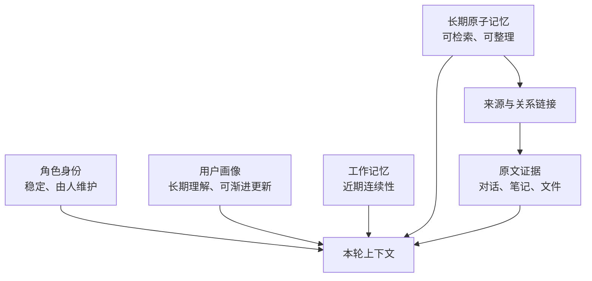
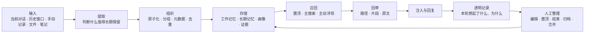
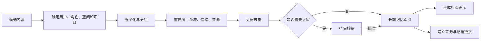
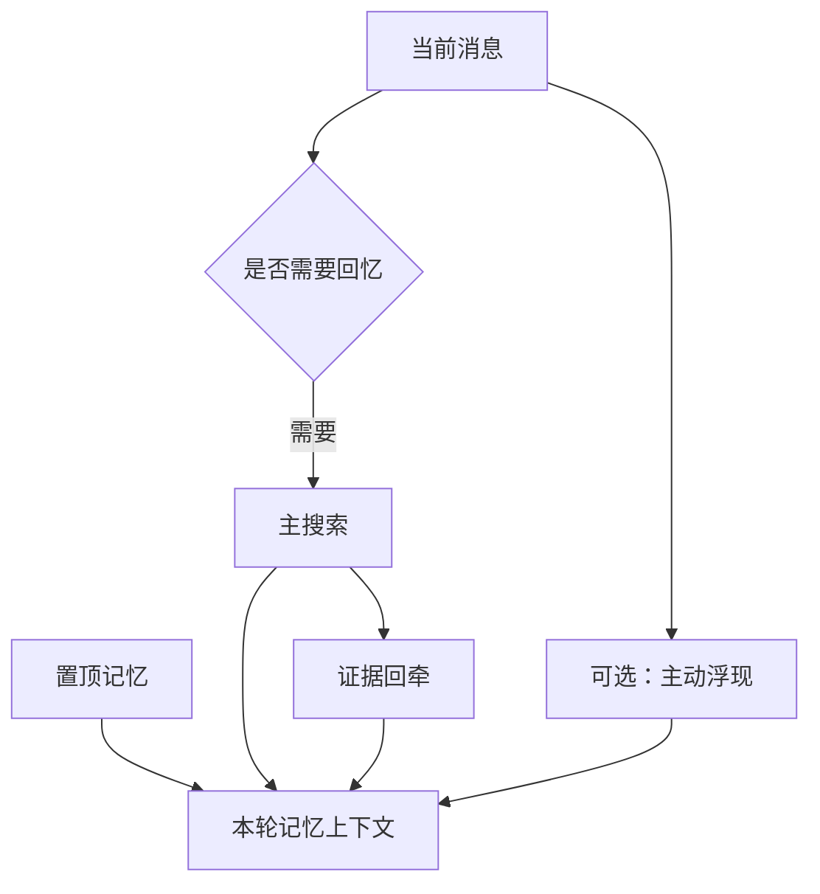

# AI 伴侣记忆架构：设计原则与 AZOTH 参考实现

> **文档版本：v6.2 · 2026-07-23**
>
> 本文面向长期 AI 伴侣用户、角色系统设计者和开发者。前半部分讨论可复用的记忆架构，后半部分记录 AZOTH 的参考实现与当前能力边界。

---

## 0. 这套架构想解决什么

AI 伴侣的长期记忆，不只是“保存过往消息”或“从向量库搜索几段文字”。

一套真正服务长期关系的记忆系统，需要同时处理：

- **连续性**：跨窗口、跨时间仍能接住共同经历；
- **选择性**：不是每轮把全部历史塞给模型，而是在合适的时候想起合适的事；
- **可信度**：记忆能回到原始对话、笔记或文件核对；
- **成长性**：AI 对人的理解可以随长期相处更新；
- **边界感**：不同角色、空间和项目的记忆不会彼此串线；
- **可控性**：人能查看、修改、置顶、结束、归档和整理记忆；
- **可解释性**：人能知道这一轮想起了什么，以及为什么。

AZOTH 是这套思想的一种参考实现，而不是唯一答案。具体模型、数据库和参数都可以替换，分层原则和治理边界更值得复用。

---

## 1. 设计原则

### 1.1 把不同性质的“记住”分开

角色身份、用户画像、近期上下文、长期经历和原文证据不应写进同一块文本。

它们的更新频率、可信度、使用方式和风险完全不同：

```text
角色身份   → 我是谁
用户画像   → 我怎样长期理解你
工作记忆   → 我们刚刚聊了什么
长期记忆   → 我们曾经经历过什么
原文证据   → 当时实际上发生了什么
```

### 1.2 记忆与证据分离

浓缩记忆负责快速联想，原始材料负责证明。

一条适合召回的记忆可以很短，但它应该能够沿着来源链接回到原始对话、文档或文件。总结不能冒充原话，原文也不需要整篇常驻在每轮上下文里。

### 1.3 新能力不能伤害旧记忆

新写入的记忆可以拥有领域、情绪暗流、提示词等丰富元数据，但历史记忆可能没有。

因此新增信号应尽量采用**正向增强**：

- 命中领域可以加分；
- 情绪同频可以提高浮现机会；
- 缺少标签不应被惩罚；
- 解析失败时应退回基础召回，而不是让记忆消失。

### 1.4 最小可见与明确所有权

每条记忆都应知道自己属于：

- 哪个使用者；
- 哪个 AI 角色；
- 哪个空间或频道；
- 是否属于某个项目；
- 是否是所有角色都能知道的公共事实。

所有权和可见性必须同时检查。没有角色归属，不自动等于公开。

### 1.5 AI 可以建议，人负责最终确认

自动去重可以阻止明显重复写入，但以下操作不应静默发生：

- 合并两段相似经历；
- 判断两条记忆互相矛盾；
- 建立有意义的关系边；
- 把一段经历永久归档或删除；
- 修改角色自身的核心身份。

AI 可以提出建议，最终决定留给人。

### 1.6 召回过程应该可观察

系统除了返回记忆，还应能够解释：

- 为什么本轮触发了召回；
- 哪些领域被识别；
- 哪些记忆来自主搜索，哪些是自然浮现；
- 带回了多少证据；
- 哪些可选增强实际参与了本轮。

---

## 2. 概念模型



### 2.1 角色身份

定义角色是谁、如何表达、遵守哪些边界。它变化极少，并且应由人明确维护。

### 2.2 用户画像

记录角色对使用者的长期理解，例如稳定偏好、近期变化、长期关系模式和当下关注点。

画像可以由长期材料更新，但需要：

- 与角色身份分开；
- 保存写回前快照；
- 记录支持每个结论的记忆来源；
- 人工编辑优先；
- 无法安全解析时暂停，而不是覆盖。

### 2.3 工作记忆

保存近期小结，解决当前窗口和跨窗口的短期连续性。

工作记忆通常可以直接挂载，不需要每次语义搜索；它也不应无限增长。

### 2.4 长期原子记忆

保存适合未来召回的浓缩经历。每条记忆可以携带：

- 正文；
- 发生时间与写入时间；
- 重要度；
- 所有权与可见性；
- 情绪信号；
- 记忆领域；
- 来源；
- 生命周期状态。

相关原子可以组成一个记忆组。检索可以在原子层精确匹配，再以组为单位还原完整语义。

这两个时间不能混为一谈：

- **发生时间**回答“这件事实际发生在什么时候”，用于排序、新鲜度和热度判断；
- **写入时间**回答“它什么时候进入系统”，用于创建记录与审计。

因此，今天导入的一年前对话仍然是一年前的经历，不会因为刚刚入库就获得“刚发生”的新鲜度。

### 2.5 原文证据

保存或索引：

- 原始对话窗口；
- Obsidian 笔记；
- 上传文件；
- 文档片段；
- 逐字引用。

证据的任务不是“更像记忆”，而是让记忆可核对。

---

## 3. 覆盖完整生命周期的参考流程



这条流程有两个不同的反馈回路：

1. **使用反馈**：记忆被真正召回后，更新最近访问时间和被想起次数；
2. **人工治理**：人修正内容、调整状态、批准关系或合并。

---

## 4. 记忆如何写入

### 4.1 常见入口

| 入口 | 适合的内容 |
|---|---|
| AI 主动保存 | 对话中明确值得长期保留的经历 |
| 周期小结 | 最近几轮的工作记忆与候选长期记忆 |
| 批量蒸馏 | 从多段小结中提炼长期事实或更新用户画像 |
| 受控历史对话蒸馏 | 从使用者选择的历史窗口提取候选，同时保留原文、来源和发生时间 |
| 人工新建 | 使用者明确希望保存的内容 |
| 文件蒸馏 | 从文档中提出候选，等待人审核 |
| 笔记与原始对话 | 作为证据来源或稳定参考材料 |

长对话不适合按任意条数机械切碎。更稳妥的做法是优先尊重自然时间断层，再按内容预算分块，并保持一问一答完整。每个块可以独立处理和续跑；蒸馏结果先进入待审核箱，不因导入动作自动成为长期记忆。

### 4.2 推荐的写入链



### 4.3 去重与冲突

推荐把三类事情分开：

- **明显重复**：写入时可以阻止；
- **高度相似**：展示给人决定是否合并；
- **可能矛盾**：建立关系或提示复核，不自动裁决哪条为真。

长期关系中的两段相似话语可能发生在不同时间、拥有不同意义。自动合并很容易抹掉变化过程。

### 4.4 用户画像蒸馏

用户画像适合使用时间分层，而不是不断追加无结构事实，也不是让一次新对话同时重写四层：

```text
新近材料
    ↓ 只进入并融合
当下最在意
    ↓ 已完成或失效的旧内容结算下沉
近月变化
    ↓ 跨过更长时间后继续压缩
更早阶段
    ↓ 从跨期重复模式中谨慎析出
长期稳定
```

这条级联遵守五个边界：

1. **只有最上层接触新近原文。** 下层只接收上层已经浓缩过的叙事，避免一天的对话直接覆盖“近月”或“更早”。
2. **融合而不是整段替换。** 仍然悬而未决的线头留在上层；已经完成或失效的内容才随时间下沉。
3. **长期底色只保存稳定模式。** 单次事件不直接变成人格判断，只有跨时间反复出现的倾向才适合进入长期层。
4. **时间坐标走旁路。** 每层覆盖的时间范围和结算次数保存在独立元数据中，不写进画像正文，也不作为隐藏文字注入模型。
5. **画像整理不改动记忆本体。** 画像叙事可以浓缩，但长期原子记忆与原始证据仍保留原文和来源。

每次写回仍应保存旧版快照与支持来源；如果检测到人工编辑、输出缺节、内容异常缩水或无法安全识别，系统应放弃本轮写回或等待重试。

在 AZOTH 中，这套级联维护是显式开启的可选路线，默认兼容链不会自动切换到它。进入“更早”层时，当前实现会使用里程碑作为保留参考；精确的数值重要度裁决尚未形成可靠闭环。

---

## 5. 存储职责

一套完整实现通常需要五类数据。

### 5.1 记忆内容

- 原子记忆；
- 记忆组；
- 重要度与情绪；
- 生命周期状态；
- 所有权和可见性。

### 5.2 检索表示

- 原子级向量，适合精确片段；
- 组级向量，适合完整语义；
- 提示词向量，适合“在什么场景下想起”；
- 关键词与时间信号。

不同模型、维度和版本应分桶保存，不能混在同一相似度空间计算。

### 5.3 关系与人审

- 记忆与记忆的关系；
- 记忆与文档的关系；
- AI 提出的关系建议；
- 待审核候选。

### 5.4 证据

- 文档稳定身份；
- 原始对话出生证；
- 文档片段、字符坐标和内容哈希；
- 逐字引用验证结果。

### 5.5 召回行为与画像来源

- 某条记忆曾在什么语境被召回；
- 哪些记忆经常同场出现；
- 用户画像的历史快照；
- 每个画像层由哪些记忆支持。

---

## 6. 所有权、隐私与隔离

### 6.1 公共、角色、空间与项目

```text
公共事实   → 多个角色可以知道
角色私有   → 只属于一个 AI 伴侣
空间私有   → 还需处于特定频道或房间
项目记忆   → 只服务某个工作或长期计划
仅归档     → 退出 AI 主动视野
```

公共事实需要“公共可见”与“无角色私有归属”同时成立。任何一项缺失都不应被当作公共记忆。

### 6.2 每条召回通道都要检查边界

隔离不能只做在主搜索：

- 置顶通道要检查；
- 主动浮现要检查；
- 证据回牵要检查；
- 合并和建链要检查；
- 项目外聊天要排除项目私有内容。

否则最容易在“看起来只是辅助功能”的地方发生私密记忆泄漏。

---

## 7. 召回架构

### 7.1 四条通道



| 通道 | 作用 |
|---|---|
| 置顶 | 少量核心记忆稳定在场 |
| 主搜索 | 回答当前消息明确需要什么记忆 |
| 主动浮现 | 补充没有被直接搜索、但自然相关的联想 |
| 证据回牵 | 为命中记忆带回来源与原文 |

### 7.2 召回门卫

不是每句话都需要搜索长期记忆。

- 明确的回忆表达可以直接触发；
- 模糊表达可以交给轻量意图观察；
- 无关消息不搜索；
- 意图观察失败时应安全退化，而不是阻断聊天。

意图观察还可以顺带产出话题领域、时间提示、来源提示和当前情绪方向，供后续可选增强使用。

### 7.3 主搜索

推荐使用多车道召回：

1. 关键词匹配；
2. 原子级语义检索；
3. 组级语义检索；
4. 排名融合；
5. 可选精排；
6. 按记忆组还原结果；
7. 附着来源与证据。

不同向量模型的原始相似度不应直接比较。先在各自车道排名，再做排名融合，更能保留每条车道的第一名。

### 7.4 热度与长期分量

“最近容易想起”和“这件事本身重要”是两个信号：

```text
短期热度   → 最近是否被反复想起
长期分量   → 重要度与情绪唤醒所代表的长期价值
```

新记忆可以有冷启动保护；真正被召回会延长它的活跃周期；置顶只表示持续在场，不增加召回次数。

### 7.5 主搜索的边界

AZOTH 当前参考实现中：

- 关键词、语义、重要度和新鲜度构成基础搜索；
- 可选评分会引入热度和情绪唤醒；
- 已结束的事情普通查询时沉底，明确追问时可以找回；
- 领域与当前情绪极性不参与主搜索硬过滤；
- 情绪效价不决定一条记忆是否有资格被搜索。

这避免了情绪标签把基础召回变成一个难以解释的黑箱。

---

## 8. 主动浮现与情绪同频

### 8.1 为什么需要独立浮现层

主搜索回答“当前问题最相关的记忆是什么”。自然联想还会受到：

- 最近热度；
- AI 上一句回复留下的语义余味；
- 过去在相似话题中出现过什么；
- 哪些记忆经常一起被想起；
- 当前话题属于哪些记忆领域；
- 某条记忆通常在什么场景下被唤起。

把这些信号放在独立浮现层，可以增强关系感，又不破坏主搜索的稳定性。

### 8.2 Lite 与 Full

| 层 | 什么时候运行 | 主要作用 |
|---|---|---|
| Lite | 每轮，可选开启 | 从高热、新记忆和当前语义中补少量联想 |
| Full | 主搜索发生后 | 结合余味、历史语境、共召回边、领域和提示词 |

Full 层还可以从整库补回低热但与当前领域高度一致的旧记忆，而不只重排最近一小批候选。

### 8.3 领域路由

当前消息可以属于一个或多个领域，例如：

```text
relationship · emotion · health · aesthetic · cognition
task · study · daily · system · other
```

领域命中只提供正向增强：

- 第一相关领域可以获得更强提升；
- 其他相关领域获得较小提升；
- 没有领域标签的旧记忆保持基础资格；
- 多样性控制避免单一领域占满全部浮现位置。

### 8.4 情绪同频

当当前语境和候选记忆都属于 emotion 领域，并且正向或负向情绪方向一致时，候选可以获得额外浮现机会。

候选的情绪方向可以来自结构化暗流，也可以在缺失时从连续情绪值退化推断。

情绪同频遵守以下边界：

- 只改变浮现优先级；
- 不改写记忆；
- 不惩罚中性或未标记记忆；
- 不自动建立长期情绪曲线；
- 混合或中性情绪不会被强行判为同频。

### 8.5 浮现理由

浮现记忆应与主搜索结果分开，并给出简短理由：

```text
💭 [记忆内容]
原因：语义余味 / 相似话题 / 共同出现 / 同一领域 / 场景匹配 / 情绪同频
```

理由不是完整模型解释，但至少让使用者知道这条记忆为什么在此刻出现。

---

## 9. 证据回牵

### 9.1 三种注入强度

| 档位 | 行为 | 适用情况 |
|---|---|---|
| 路径 | 只给标题和位置 | 默认，成本最低 |
| 片段 | 带回可靠范围内的原文 | 需要核对具体说法 |
| 全文 | 带回完整存档 | 少量高价值材料 |

默认只给路径，把是否深挖原文的决定留给角色或使用者。

### 9.2 稳定身份与漂移

文档路径会变化，稳定身份不应随改名或移动丢失。

证据片段需要记录：

- 文档稳定 ID；
- 标题层级；
- 字符范围；
- 内容哈希；
- 预览文本；
- 当前状态。

原文变化后，如果旧范围无法再验证，应标记为 stale 或 drifted，只保留安全路径和旧预览，不继续把它当作可靠现行原文。

### 9.3 逐字引用

标为“逐字引用”的文本必须能在来源中机械找到。

无法验证时，可以保留为未验证候选，但不能向模型或使用者暗示它已经被证实。

---

## 10. 输出与召回透明度

### 10.1 本轮上下文分区

典型上下文可以按来源分成：

```text
角色身份
世界知识
用户画像
工作记忆
置顶记忆
主搜索记忆
主动浮现记忆
原文证据
```

分区可以防止模型把原文、总结、画像和系统观察混成同一种可信度。

### 10.2 本轮透明记录

AZOTH 把这份只读记录称为“蒸馏纪”。它可以包含：

- 是否运行了意图观察；
- 是否触发主召回；
- 使用了哪类召回；
- 哪些领域被激活；
- 主搜索与自然浮现的数量；
- 浮现原因；
- 证据数量；
- 当前上下文模式。

透明记录属于人类界面，不属于下一轮模型输入。保存消息时可以留在本轮元数据中，发送下一轮前应剥离。

---

## 11. 生命周期与人类治理

### 11.1 正交状态

```text
置顶       → 是否稳定在场
已结束     → 事情是否已经处理完
可见性     → 谁能看、AI 是否还能主动看
重要度     → 这件事本身的分量
热度       → 最近是不是容易被想起
```

这些状态不应压成一条 `active → archived → deleted` 的线性生命周期。

例如：

- 一件事情可以已经结束，但仍然非常重要；
- 一条记忆可以置顶，同时只属于一个角色；
- 一条记忆可以低热，但在明确追问时重新出现；
- 归档可以让它退出 AI 主动视野，同时保留给人查看。

### 11.2 热度不会改写正文

热度下降只意味着普通召回更不容易选中。

它不会：

- 删除正文；
- 降低文字分辨率；
- 让模型重写成更模糊的版本；
- 把一段记忆从 1.0 自动压缩到 0.5。

### 11.3 定期维护

适合自动维护的是行为副产品，例如：

- 过旧的召回语境记录；
- 长期没有强化的弱共召回边；
- 失联文档状态；
- 可重新生成的影子向量。

不适合无人值守自动改写的是珍贵记忆正文与角色身份。用户画像可以在独立的时间分层中渐进维护，但必须保留快照与来源，并让人工编辑优先；画像叙事的结算下沉不等于长期记忆正文被改写。

---

## 12. 当前能力边界

### 12.1 稳定基础

- 工作记忆、长期记忆、用户画像和证据分层；
- 原子级与组级融合召回；
- 角色、空间、项目和公共事实隔离；
- 置顶、已结束、归档、重要度等状态；
- 证据路径、片段和全文回牵；
- 人工编辑、待审核、合并与关系建议；
- 用户画像快照和来源；
- 本轮召回透明记录；
- 按时间浏览记忆。

### 12.2 可选增强

- 主动浮现；
- 领域路由；
- 情绪同频；
- 提示词向量；
- 领域共现；
- 整库低热同域候选；
- 候选精排；
- 部分证据自动推荐；
- 用户画像时间级联维护。

这些能力是否运行，取决于具体部署设置。

### 12.3 当前非目标或尚未提供

- **前端时间线**：已有时间浏览能力，没有专用可视化时间线；
- **关系图谱 UI**：已有关系数据和列表，没有节点—边交互画布；
- **自动冲突裁决**：系统不自动决定哪段相似或矛盾记忆为真。

---

## 13. 如何把这套架构带到其他 AI 伴侣系统

### 13.1 最小可行版本

不必一次实现全部能力。推荐顺序：

1. 先分开工作记忆、长期记忆和原文证据；
2. 为每条长期记忆增加用户、角色和可见性；
3. 实现基础关键词 + 语义搜索；
4. 加入查看、编辑、归档和置顶；
5. 让搜索结果能回到原始来源；
6. 再增加热度、主动浮现、领域和情绪增强；
7. 最后加入用户画像蒸馏与透明记录。

### 13.2 API 聊天模型

可以在发送请求前完成：

- 短期记忆挂载；
- 召回门卫；
- 主搜索；
- 置顶与自然浮现；
- 证据回牵；
- 分区注入。

### 13.3 原生 Agent

Codex、Claude Code 等 Agent 已经拥有自己的短期上下文管理时，可以省去重复的工作记忆层，把能力暴露成工具：

```text
memory_save
memory_search / memory_recall
memory_recent
get_pinned_memories
read_evidence
```

Agent 决定何时调用，记忆系统负责长期保存、边界和证据。需要注意：工具调用前如果没有独立意图观察，领域和当前情绪信号不会凭空出现。

### 13.4 多角色系统

多角色不是在界面加一个角色选择器就完成了。隔离必须贯穿：

- 写入；
- 主搜索；
- 置顶；
- 主动浮现；
- 证据；
- 合并；
- 项目范围；
- 画像。

---

## 14. AZOTH 参考实现

以下内容帮助希望对照源码或复刻实现的读者。

### 14.1 数据载体

| 类别 | AZOTH 载体 | 职责 |
|---|---|---|
| 工作记忆 | `memory_tables` / `longTermMemory` | 近期小结与兼容数据 |
| 长期记忆 | `memory_index` | 原子正文、状态、所有权和元数据 |
| 组级检索 | `memory_group_embeddings` | 组级影子向量 |
| 提示检索 | `memory_hint_embeddings` | 召回提示词影子向量 |
| 领域共现 | `memory_scope_cooccurrence` | 每用户领域共现快照 |
| 关系 | `memory_links` | 记忆、来源和文档之间的稳定边 |
| 关系人审 | `memory_link_suggestions` | AI 建议、人批准 |
| 待审核 | `memory_staging` | 文件与历史对话蒸馏等候选 |
| 文档证据 | `obsidian_documents` | 文档稳定身份、位置和状态 |
| 对话出生证 | `source_contexts` | 源窗口、参与者和时间范围 |
| 片段证据 | `source_chunks` | 字符坐标、标题路径和哈希 |
| 片段向量 | `source_chunk_embeddings` | 多模型证据影子向量 |
| 召回历史 | `memory_recall_context` | 查询语境 |
| 行为边 | `memory_co_recall` | 同场召回形成的弱联系 |
| 画像快照 | `user_persona_snapshots` | 写回前版本 |
| 画像来源 | `user_persona_provenance` | 各时间层支持记忆 |
| 画像时间坐标 | `user_persona_layer_meta` | 各时间层覆盖范围与结算记录，不进入画像正文 |
| 画像整理留痕 | `user_persona_forget_log` | 未进入更早层的低价值叙事留痕，不注入上下文 |

历史导入还保留两套时间语义：记忆的 `timestamp` 可以来自原始对话块的 `occurred_start / occurred_end`，用于表达事情实际发生的时间；`created_at` 仍记录它何时进入 AZOTH，用于审计。

`user_persona_forget_log` 当前没有面向使用者的查看或确认界面，只属于内部旁路留痕，不构成人类可操作的治理面。

### 14.2 所有权表示

AZOTH 使用：

```text
角色私有：character_id = 当前角色
公共事实：character_id IS NULL
          且 visibility = shared_public_fact
```

其他可见性包括 `private_character`、`private_space` 和 `archive_only`。项目记忆另外使用项目范围。

### 14.3 检索实现

- 原子级本地向量：bge-small-zh-v1.5，512 维；
- 组级与提示影子向量：Qwen3-Embedding-0.6B，1024 维；
- 默认主引擎：原子与组级双车道 RRF 融合；
- 可选：热度评分 v2、Reranker、主动浮现、证据推荐。

基础单车道评分由关键词、语义、重要度和新鲜度组成；可选评分把重要度/新鲜度替换为长期分量/短期热度。RRF 在车道内排名后融合，不直接比较两个模型的原始相似度。

### 14.4 用户画像输出模式

AZOTH 的批量蒸馏支持：

| 模式 | 行为 |
|---|---|
| `legacy` | 从一批小结继续提取长期原子记忆 |
| `persona` | 更新 `user-persona.md`，不追加画像碎片 |
| `off` | 不蒸馏，也不推进相关游标 |

未配置时保留兼容旧链。部署者需要主动选择是否启用画像模式。

在 `persona` 模式之内，时间级联仍有独立开关。启用后，新近原文只更新“当下最在意”，其余层通过结算下沉与稳定倾向析出维护；关闭时继续使用兼容的批量画像更新方式。

### 14.5 可选能力的安全默认

AZOTH 把以下能力设为显式选择或独立开关：

- 轻量意图观察；
- 热度评分；
- 主动浮现；
- 领域路由；
- 情绪暗流；
- 提示向量；
- 领域共现；
- 随机旧记忆漂移；
- 候选精排；
- 用户画像时间级联。

安全默认的目的，是让基础召回在增强能力关闭或失败时仍可运行。具体部署是否启用，不能仅根据代码存在判断。

### 14.6 源码导航

| 模块 | 职责 |
|---|---|
| `services/memory-records.js` | 记忆、状态、关系、合并和所有权 |
| `tools/memory.js` | 长期记忆写入 |
| `tools/memory-search.js` | 主搜索、置顶、空间召回和证据附着 |
| `services/memory-surfacing.js` | 主动浮现、领域、提示和情绪增强 |
| `services/memory-injection-format.js` | 记忆、浮现与证据注入格式 |
| `services/phase2-extractor.js` | 批量结构化提取 |
| `services/persona-distiller.js` | 用户画像蒸馏 |
| `services/official-distill.js` | 受控历史对话切块、续跑、时间锚定与候选提取 |
| `services/turn-snapshot.js` | 本轮召回透明记录 |
| `services/memory-group-embeddings.js` | 组级影子向量 |
| `services/memory-hint-embeddings.js` | 提示词影子向量 |
| `services/memory-scope-cooccurrence.js` | 领域共现 |
| `services/source-context.js` | 对话出生证 |
| `services/source-chunks.js` | 文档片段证据 |
| `services/evidence-quote.js` | 逐字引用验证 |
| `services/memory-link-suggestions.js` | 关系建议与人审 |
| `routes/ai.js` | 聊天主链、召回、注入、画像与透明记录 |
| `memory-desk.js` | 人类记忆工作台 |

### 14.7 验证策略

建议把验证分成三层：

1. **静态追链**：入口是否真正连接到存储、召回、注入和输出；
2. **专项回归**：状态、边界、画像、证据、领域和浮现分别测试；
3. **运行验证**：确认部署开关和真实请求确实使用了目标能力。

本地测试可以证明代码路径存在，不能代替运行环境的真实启用证据。

---

## 15. 采用建议

如果你只借走三件事，建议优先选择：

1. **把记忆与原文证据分开，但保持可回牵；**
2. **让角色、空间和项目边界贯穿所有召回通道；**
3. **把最终整理权留给人，并让召回过程可解释。**

模型和向量库会不断变化，这三条原则更可能长期成立。
