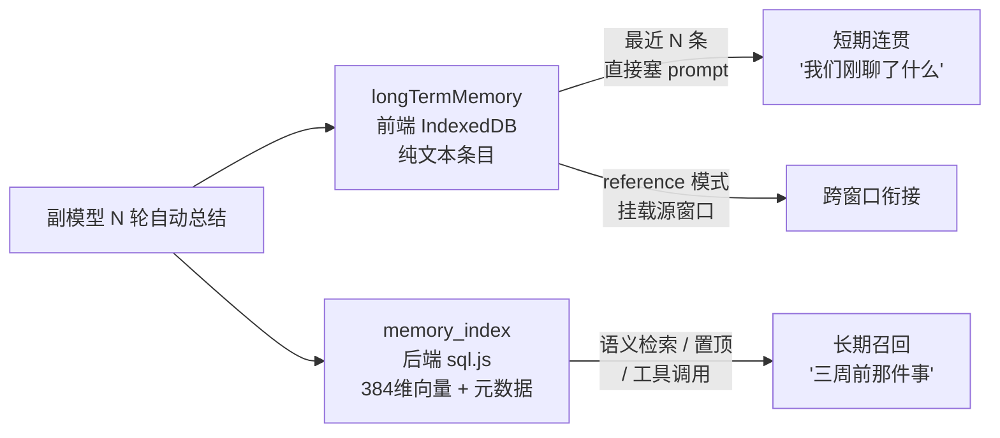
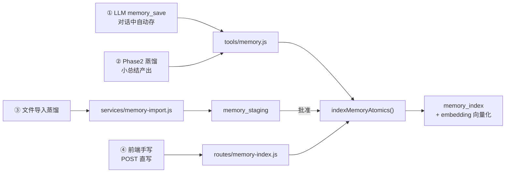
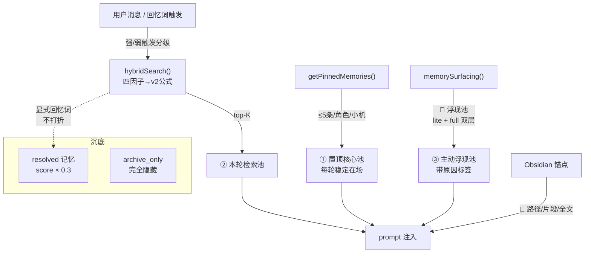
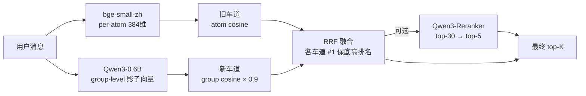
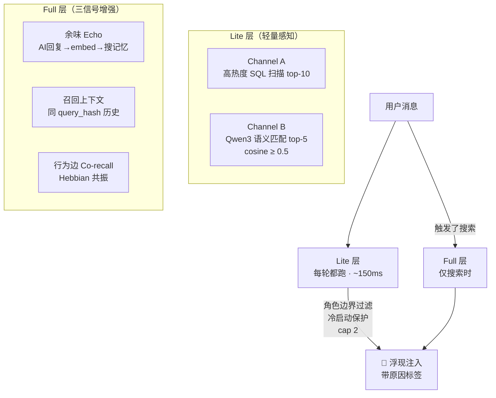

# AZOTH 记忆系统 — 架构全景

> **版本**：v5.2 · 2026-06-20 更新 · 对齐代码实际状态

---

## 0. 一句话定位

AZOTH 的记忆不是"搜得到的旧东西"——它是**有生命状态的长期心智**。有些永远在场（置顶），有些会热起来（浮现），有些会沉底（已解决），有些能回到原文（Obsidian 证据），有些会被整理合并（去重），有些会**主动冒出来**（浮现池）。

**多角色/小机原生**：AZOTH 从第一天起就为多个 AI 角色/小机共存的"多机之家"设计——每个角色/小机有独立的记忆空间、独立的 Obsidian vault 绑定、独立的置顶池，同时支持跨角色/小机共享的公共事实层。一对一也能用，但架构天然支持你家有很多位小机。

---

## 1. 架构总览

```mermaid
graph TB
    subgraph "前端层 (PWA)"
        A["script.js<br/>聊天主链"]
        B["memory-desk.js<br/>记忆工作台 · 105KB"]
        C["memory-desk.css<br/>memdesk-* 命名空间"]
        D["api-layer.js<br/>通用 API 封装"]
    end

    subgraph "网关路由层 (Express)"
        E["routes/memory-index.js<br/>列表/搜/PATCH/PUT/链接/合并"]
        F["routes/memory-staging.js<br/>待审核 approve/reject"]
        G["routes/memory-chain.js<br/>对话链/N轮总结"]
        H["routes/obsidian-docs.js<br/>文档索引/扫描"]
    end

    subgraph "服务层 (Business Logic)"
        I["services/memory-records.js<br/>85KB · 核心CRUD+状态+链接+合并"]
        J["services/memory-import.js<br/>文件蒸馏导入"]
        K["services/obsidian-index.js<br/>Vault BFS扫描+身份追踪"]
        L["services/phase2-extractor.js<br/>Phase2 蒸馏抽取"]
        L2["services/memory-surfacing.js<br/>24KB · 主动浮现池"]
        L3["services/memory-group-embeddings.js<br/>9KB · Qwen3影子向量"]
        L4["services/memory-link-suggestions.js<br/>8KB · 关系建议箱"]
        L5["services/source-context.js<br/>33KB · 出生证管理"]
        L6["services/source-chunks.js<br/>19KB · 文档段落证据"]
        L7["services/evidence-quote.js<br/>2KB · 逐字引用验证"]
        L8["services/memory-injection-format.js<br/>9KB · 注入格式化"]
    end

    subgraph "工具层 (LLM 可调用)"
        M["tools/memory.js<br/>42KB · memory_save · 写入链"]
        N["tools/memory-search.js<br/>94KB · hybrid+blended+contextual"]
        O["tools/merge-memory.js<br/>相似簇+合并"]
        P["tools/obsidian-wakeup.js<br/>7个Obsidian MCP工具"]
    end

    subgraph "数据层 (sql.js · db.js 78KB)"
        Q["memory_index<br/>原子记忆 · 384维+Qwen3影子"]
        R["memory_links<br/>端点式关系表"]
        R2["memory_link_suggestions<br/>人审关系建议"]
        S["memory_staging<br/>待审核暂存"]
        T["obsidian_documents<br/>文档索引"]
        T2["source_contexts<br/>记忆出生证"]
        T3["source_chunks<br/>文档段落证据"]
        T4["source_chunk_embeddings<br/>段落多模型向量"]
        T5["memory_group_embeddings<br/>Qwen3组级影子向量"]
        T6["memory_recall_context<br/>召回语境"]
        T7["memory_co_recall<br/>赫布行为边"]
        U["ai_memories<br/>旧格式·只读遗产"]
    end

    subgraph "维护层 (Scripts)"
        V["scripts/verify-memory-states.js<br/>194项 smoke"]
        W["scripts/verify-memory-desk.js<br/>86项 smoke"]
        X["scripts/compare-memory-scoring.js<br/>v1/v2 离线对比"]
        Y["scripts/backfill-memory-meta.js<br/>历史回填"]
    end

    subgraph "Obsidian 层"
        Z["Vault 文件系统<br/>via MCP 工具访问"]
        AA["azoth-index.md<br/>每 vault 索引清单"]
    end

    A --> E & F & G
    B --> E & F & H
    E --> I
    F --> I
    G --> M
    H --> K
    I --> Q & R & S
    J --> M & I
    K --> T & P
    L --> M
    M --> Q
    N --> Q & R & T & T5
    O --> I
    P --> Z
    L2 --> N & T6 & T7
    L3 --> T5
    L4 --> R2
    L5 --> T2
    L6 --> T3 & T4
    L7 --> T3
```



### 1.5 记忆在认知全景里的位置

AI 角色/小机的 prompt 组装链涉及四个认知层，记忆系统管的是下面两层：

```
身份层（极少变，人写的）
└── 人设 persona prompt → "我是谁"

知识层（人工策展，关键词触发）
└── 世界书 worldbook → "世界是什么样的"

─ ─ ─ ─ ─ ─ ─ ─ ─ ─ ─ ─ ─ ─ ─ ─ ─ ─ ─
  ↓ 以下是记忆系统的范围 ↓

工作记忆层（每轮自动，短期连贯，纯前端）
└── longTermMemory → "我们刚聊了什么"

长期记忆层（向量化，有生命状态，后端）
└── memory_index → "我们经历过什么"
```

身份和知识是**你写的**，角色/小机不会自己改自己的人设。记忆是**从交互中生长的**。

### 1.6 双层记忆分工

副模型每 N 轮自动总结时，产出**同时双写**：



| | longTermMemory（工作记忆） | memory_index（长期记忆） |
|---|---|---|
| **存在哪** | 前端 IndexedDB，跟着窗口走 | 后端 sql.js，跟着角色/小机走 |
| **格式** | 纯文本条目 | 384维向量 + 元数据 + 状态 |
| **注入方式** | 最近 N 条直接塞进 prompt | 语义检索 top-K / 置顶通道 / 工具调用 |
| **跨窗口** | `reference` 模式挂载源窗口最后 N 条 | 自动跟角色/小机走，无需特殊处理 |
| **解决什么** | "我们刚聊了什么"（短期连贯） | "三周前那件事的细节"（长期召回） |

换窗口时：`reference` 模式 + `mountMemoryCount` 条挂载 = 短期无缝。长期需要回忆 = 角色/小机用工具去 memory_index 里找。

---

## 2. 数据模型

### 2.1 memory_index — 原子记忆表（核心）

> `server/db.js`

| 字段 | 类型 | 语义 |
|------|------|------|
| id | INTEGER PK | — |
| user_id | TEXT | 用户 |
| character_id | TEXT | 角色/小机（或 `shared` 共享池） |
| content | TEXT | 记忆正文（浓缩） |
| embedding | TEXT | 384维 bge-small-zh 向量（JSON） |
| importance | REAL [0,1] | 长期重要度（手调或写入时定） |
| group_id | TEXT | 组 ID（N轮总结等多原子组） |
| space_key | TEXT | 空间键（多端隔离用） |
| visibility | TEXT | `shared_public_fact` / `private_character` / `private_space` / `archive_only` |
| source_type | TEXT | `llm_tool` / `phase2_distill` / `auto_summary` / `manual` / ... |
| **pinned** | INTEGER 0/1 | 置顶（独立通道，不参与衰减） |
| **resolved_at** | TEXT NULL | 已解决时间（NULL=未解决） |
| **activation_count** | INTEGER | 被想起次数（每次召回+1，置顶在场不计） |
| **valence** | REAL [0,1] NULL | 情绪效价（NULL=未标注→0.5兜底） |
| **arousal** | REAL [0,1] NULL | 情绪唤醒度 |
| **meta_json** | TEXT NULL | 蒸馏元数据 JSON（scope/emotionTag/entities/pending/reason） |
| last_accessed_at | TEXT | 最近被想起时间 |
| participants_json | TEXT | Discord 参与者 tokens |
| timestamp | TEXT | 创建时间 |

**多角色/小机隔离**：`character_id` 决定一条记忆属于哪个角色/小机。检索时按角色/小机过滤，角色/小机 A 的私有记忆不会出现在角色/小机 B 的召回结果里。`shared` 池是全家共享的公共事实（比如"主人讨厌香菜"），所有角色/小机都能检索到。`visibility` 四档进一步控制可见范围——`private_space` 的记忆只在特定空间（如某个 Discord 频道）可见。

### 2.2 memory_links — 关系表

| 字段 | 语义 |
|------|------|
| left_kind | `row` / `group` / `ai` / `obsidian` / `obsidian_chunk` / `source_context` |
| left_key | 左端 ID |
| right_kind | 同上 |
| right_key | 右端 ID |
| relation_type | `related` / `prerequisite` / `contradicts` / `merged_into` / `source` / `evidence` |
| meta_json | `{injectMode, snippet}` 注入模式配置 |

### 2.3 obsidian_documents — 文档索引表

| 字段 | 语义 |
|------|------|
| id (= azoth_doc_id) | 稳定身份，不随改名变 |
| vault_key (= serverId) | MCP 服务稳定 ID |
| vault_name | 显示名（可改不断链） |
| path | 当前路径（移动时更新） |
| title | 文件标题 |
| content_hash | 内容指纹（变动检测） |
| content_text | 正文存档（≤60000字，full 档数据源） |
| doc_type | `daily` / `reference` / `evidence` / `upload` |
| status | `active` / `missing`（失联标状态不删行） |
| id_written | frontmatter 是否写回 |

**每角色/小机独立 vault**：每个角色/小机可以绑定自己的 Obsidian vault（通过 MCP 服务），扫描索引和证据关联都是角色/小机级别的。角色/小机 A 的 vault 里的笔记不会被角色/小机 B 的记忆关联到。

### 2.4 memory_staging — 待审核表

蒸馏/Phase2 产出 → 进 staging → 工作台人审 approve/reject → 通过后进 memory_index。

### 2.5 memory_group_embeddings — 组级影子向量表

> Qwen3-0.6B 替代/补充 legacy bge-small-zh 的 per-atom 向量。支持 A/B 评估。

| 字段 | 类型 | 语义 |
|------|------|------|
| group_id | TEXT | 对应 memory_index.group_id |
| provider | TEXT | 模型提供方 |
| model | TEXT | 模型名（如 `Qwen3-0.6B`） |
| dim | INTEGER | 向量维度 |
| version | INTEGER | 版本号（支持灰度切换） |
| embedding | TEXT | 组级聚合向量（JSON） |

当前状态：**644 组已重新向量化**。Blended 召回引擎用此表做 RRF 融合的 Qwen3 车道。

### 2.6 memory_link_suggestions — 关系建议表（8-b）

> 角色/小机提议"A 和 B 可能有关系"→ 进此表 → 人审批通过才真建 memory_links 条目。

| 字段 | 类型 | 语义 |
|------|------|------|
| id | INTEGER PK | — |
| character_id | TEXT | 提议角色/小机 |
| left_kind / left_key | TEXT | 左端点 |
| right_kind / right_key | TEXT | 右端点 |
| relation_type | TEXT | 建议的关系类型 |
| reason | TEXT | 角色/小机给出的理由 |
| status | TEXT | `pending` / `approved` / `rejected` |
| meta_json | TEXT | 扩展信息 |

**铁律**：`merged_into` 关系永不暴露给 AI，只有人能操作。

### 2.7 source_contexts — 记忆出生证（7C）

> 每条记忆的"出生证"——记录它诞生于哪段对话、什么时间窗口、谁参与了。

| 字段 | 类型 | 语义 |
|------|------|------|
| id | INTEGER PK | — |
| memory_id / group_id | TEXT | 关联的记忆 |
| conversation_window | TEXT | 对话窗口标识 |
| time_start / time_end | TEXT | 源对话时间范围 |
| speakers | TEXT | 参与者 |
| status | TEXT | `active` / `drifted` / `missing` / `snapshot_only` |
| meta_json | TEXT | 扩展信息 |

### 2.8 source_chunks — 文档段落证据（7B-A）

> 从 Obsidian 文档切出的段落级证据块，带字符坐标、内容哈希、标题路径。

| 字段 | 类型 | 语义 |
|------|------|------|
| id | INTEGER PK | — |
| doc_id | TEXT | 关联的 obsidian_documents.id |
| char_start / char_end | INTEGER | 在原文中的字符范围 |
| content_text | TEXT | 段落内容 |
| content_hash | TEXT | 内容指纹（变动检测） |
| heading_path | TEXT | 标题层级路径 |
| status | TEXT | `active` / `stale` / `missing` |

### 2.9 source_chunk_embeddings — 段落多模型向量（7B-B）

> 为 source_chunks 提供多模型向量（bge-m3 / Qwen3-0.6B），支持 A/B 评估。

| 字段 | 类型 | 语义 |
|------|------|------|
| chunk_id | INTEGER | 关联的 source_chunks.id |
| provider / model / dim / version | TEXT/INT | 模型标识 |
| embedding | TEXT | 向量（JSON） |

### 2.10 memory_recall_context — 召回语境记录（8-c）

> 记录每条记忆在什么查询语境下被召回过。query_hash = MD5(query[:200])。

| 字段 | 类型 | 语义 |
|------|------|------|
| memory_id | INTEGER | 被召回的记忆 |
| query_hash | TEXT | 查询指纹 |
| recalled_at | TEXT | 召回时间 |

启用"上次你问这个话题时，也想起了 X"的语境关联能力。

### 2.11 memory_co_recall — 赫布行为边（8-c）

> 记忆间的 Hebbian 行为边——同场召回的记忆自动连边，越频繁越强。

| 字段 | 类型 | 语义 |
|------|------|------|
| memory_a / memory_b | INTEGER | 共同召回的两条记忆 |
| strength | REAL | 连边强度（+0.05/次，上限 5.0） |
| co_count | INTEGER | 共同召回次数 |
| last_co_at | TEXT | 最近共同召回时间 |
| stability | REAL | 稳定性（间隔重复增长） |

**清理机制**：启动后 30s + 每 24h，清理 >90 天的 recall_context 和弱 co_recall 边。

---

## 3. 核心数据流

### 3.1 记忆写入（四条路）



**关键**：四条写入路都经过 `indexMemoryAtomics()`，**valence/arousal/meta_json 全套透传**。

### 3.2 记忆召回（三个池 + 一个通道 + 浮现层）



**多角色/小机置顶隔离**：每个角色/小机有独立的置顶池（≤5 条/角色/小机），互不干扰。角色/小机 A 置顶的"我们的纪念日"不会出现在角色/小机 B 的 prompt 里。空间可见性在置顶通道同样生效——space B 的私有置顶不会泄进 space A。

### 3.3 召回公式 v2（灰度开关 `memoryScoringV2`）

```
召回分 = 关键词得分 × 0.3
       + 向量语义得分 × 0.4
       + 质量得分 × 0.3      ← v1: importance×0.2+freshness×0.1 | v2: longTermWeight×0.2+heatScore×0.1
       - resolved 沉底惩罚(×0.3, 强回忆词减免)
```

**热度公式（借鉴 kiwi-mem + Ombre-Brain）**：
```
initialTemp = min(1, 0.3 + max(importance, arousal) × 0.7)
halfLife    = baseHalfLife × (1 + activationCount × 0.3)  // 越常想起越不易忘
decay       = 2^(-daysSinceAccess / halfLife)
recallBonus = min(0.2, activationCount × 0.02)
heat        = initialTemp × decay + recallBonus
// 冷启动保护：activationCount=0 时 30天内保底 0.3+importance×0.5
```

**长期权重**：`importance × (0.7 + 0.6 × arousal)` —— 情绪唤醒提升长期留存力。

### 3.4 Blended 召回引擎（双车道 RRF 融合）



**召回引擎模式**（`RECALL_ENGINE` 环境变量）：

| 模式 | 行为 |
|------|------|
| `old` | 仅 bge-small-zh per-atom cosine（遗产） |
| `shadow_only` | 仅 Qwen3 group 影子（观测模式） |
| `qwen_primary` | Qwen3 为主引擎 |
| **`blended`**（当前默认） | **RRF 融合双车道**，Qwen3 权重 ×0.9，各车道 #1 获保底高排名 |

**Reranker**（灰度，默认关闭）：top-30 候选 → Qwen3-Reranker 精排 → top-5。

### 3.5 召回触发器系统

不是每条用户消息都触发记忆检索。副模型先判断是否需要召回：

| 触发类型 | 关键词示例 | 行为 |
|---------|----------|------|
| **强触发**（直接召回） | 之前/上次/记得/你说过/聊过/那件事 | 直接进入 hybridSearch |
| **弱触发**（副模型确认） | 查一下/搜一下/来着/怎么弄的 | 副模型返回 should_recall + topic_anchors + time_hint |
| **无触发** | 今天天气/你好/随便聊 | 不召回，防止注入无关记忆 |

副模型输出：`{ should_recall, topic_anchors, time_hint, vault_hint, confidence }`

### 3.6 主动浮现池（8-c · 灰度）

**设计目标**：让记忆从"被动被搜到"进化到"主动像人一样想起"。

**双层架构**：



**浮现评分公式**：
```
surfacingScore = (heat × 0.6 + longTermWeight × 0.4)
  + signalBoost(echo + context + coRecall, cap 0.6)
  + coldStart(0.3, 新重要记忆)
  × urgency(1.5, arousal>0.7 且未解决)
  × surfaceFatigue(0.3, 今天已浮现≥3次)
```

**随机漂移**：30% 概率浮现低热度旧记忆（recall<2），灰度默认关闭。

**注入格式**：`💭 [记忆内容] [原因标签]`，原因标签包括：余味 / 想到相关的事 / 曾在相似话题想起 / 新记忆。

**当前状态**：`MEMORY_SURFACING` 环境变量开关，默认 OFF。角色边界修复已于 6/20 上线。

---

## 4. 文件清单 × 职责

### 4.0 数据层

| 文件 | 大小 | 职责 |
|------|------|------|
| `server/db.js` | 78KB | **全表 schema + 迁移**：11 张记忆相关表定义 |

### 4.1 后端 — 服务层

| 文件 | 大小 | 职责 |
|------|------|------|
| `services/memory-records.js` | 85KB | **核心**：CRUD / patchMemoryState / updateMemory(重向量化) / memory_links CRUD / mergeMemories / group重建保留状态 |
| `services/memory-import.js` | 8KB | 文件蒸馏（副模型抽≤5条候选→staging） |
| `services/obsidian-index.js` | 26KB | Vault BFS扫描 / azoth_doc_id 身份追踪 / 失联检测 / 旧格式兼容门 |
| `services/phase2-extractor.js` | 8KB | Phase2 蒸馏元数据抽取 |
| `services/wakeup-heat.js` | 12KB | wakeup 路径的热度系统 |
| `services/memory-surfacing.js` | 24KB | **主动浮现池**：lite/full 双层 + 三信号(echo/context/co-recall) + 评分公式 + 随机漂移 + 清理 cron |
| `services/memory-injection-format.js` | 9KB | 召回/浮现记忆的 prompt 注入格式化 |
| `services/memory-group-embeddings.js` | 9KB | Qwen3 组级影子向量管理（644组已重建） |
| `services/memory-link-suggestions.js` | 8KB | 关系建议箱（角色提议→人审→建链） |
| `services/source-context.js` | 33KB | 记忆出生证管理（对话窗口溯源） |
| `services/source-chunks.js` | 19KB | 文档段落证据（hash漂移检测） |
| `services/evidence-quote.js` | 2KB | 逐字引用机械验证（verified/unverified/absent） |

### 4.2 后端 — 工具层（LLM 可调用）

| 文件 | 大小 | 职责 |
|------|------|------|
| `tools/memory.js` | 42KB | `memory_save` 工具：写入链（含 valence/arousal/meta 透传）+ Jaccard 75% 写入去重 |
| `tools/memory-search.js` | 94KB | `memory_search` / `memory_recall`：**blended 双车道 RRF** + hybrid 四因子 + contextual + heatScore + 置顶通道 + resolved 惩罚 + Obsidian 锚点 + Reranker(灰度) |
| `tools/merge-memory.js` | 9KB | 相似簇发现 + 合并端点 |
| `tools/obsidian-wakeup.js` | 15KB | 7个 Obsidian MCP 工具（3读4写）+ 角色/小机 vault 绑定 |

### 4.3 后端 — 路由层

| 文件 | 大小 | 职责 |
|------|------|------|
| `routes/memory-index.js` | 57KB | 完整 REST：列表/搜索/分页/stats / PATCH(6字段) / PUT content(重向量化) / GET links / POST links / DELETE links / PATCH links(注入模式) / similar-groups / merge / POST直写 |
| `routes/memory-staging.js` | 9KB | staging approve/reject + 批量清积压 |
| `routes/memory-chain.js` | 14KB | N轮对话链 + 小总结 auto_summary |
| `routes/obsidian-docs.js` | 3KB | Obsidian 文档索引 REST |
| `routes/ai.js` | 431KB | **聊天主路由**：记忆注入拼装（置顶段 + 检索段 + 浮现段 + 锚点段） |

### 4.4 前端

| 文件 | 大小 | 职责 |
|------|------|------|
| `memory-desk.js` | 105KB | **记忆工作台**：详情抽屉(编辑/状态/情绪/链接/元数据) + staging审核箱 + 相似整理面板 + 手动新建 + 文件导入 + 注入模式开关 |
| `memory-desk.css` | 18KB | 工作台样式，`memdesk-` 前缀隔离 |
| `script.js` | 2.3MB | 巨石主体，记忆索引列表页（mi-系列）在此 |

### 4.5 维护/验证脚本

| 文件 | 项数 | 职责 |
|------|------|------|
| `scripts/verify-memory-states.js` | **194项** | 全字段/全路径 smoke 测试 |
| `scripts/verify-memory-desk.js` | **86项** | 前端工作台接线 smoke |
| `scripts/verify-memory-records.js` | — | 基础 CRUD 回归 |
| `scripts/verify-memory-runtime-tools.js` | — | 运行时工具集成回归 |
| `scripts/compare-memory-scoring.js` | — | v1/v2 公式离线对比 |
| `scripts/backfill-memory-meta.js` | — | 历史 auto_summary 元数据回填 |

---

## 5. 施工状态

| 阶段 | 名称 | 状态 | 核心产出 |
|----|------|------|----------|
| **1** | 记忆状态字段 + API + link 扩展 | ✅ 已上线 | 5新字段 + patchMemoryState + link新kind/relation |
| **2** | PWA 记忆工作台 | ✅ 已上线 | memory-desk.js/css + staging审核箱 + 批量归档 |
| **2.5** | 蒸馏元数据透明化 | ✅ 已上线 | meta_json 列 + 四条写入路全通 |
| **3** | 热度系统 + 召回公式v2 + 置顶通道 | ✅ 已上线 | heatScore + 灰度toggle + getPinnedMemories |
| **4** | 相似记忆合并工作台 | ✅ 已上线 | findSimilarClusters + mergeMemories + 工作台面板 |
| **5** | Obsidian 文档索引第一期 | ✅ 已上线 | obsidian_documents表 + BFS扫描 + 身份追踪 + 召回联动 |
| **6** | 手动记忆 + 文件导入 | ✅ 已上线 | 蒸馏导入 + 整篇直存 + 上传进证据层 |
| **7A** | 注入模式开关 + 手动片段锚点 | ✅ 已上线 | path/snippet/full 三档 + content_text存档 |
| **7B** | 原文层证据链 | ✅ 已上线(灰度) | source_chunks + source_chunk_embeddings + chunk推荐 |
| **7C** | 记忆出生证 | ✅ 已上线 | source_contexts 对话窗口溯源 |
| **8-a** | 逐字引用证据 | ✅ 已上线 | evidence_quote 机械验证（verified/unverified/absent） |
| **8-b** | 关系建议箱 | ✅ 已上线 | memory_link_suggestions（角色提议→人审→建链） |
| **8-c** | 主动浮现池 | ✅ 已上线(灰度) | 双层架构(lite/full) + 三信号 + surfacingScore + 角色边界(6/20修复) |
| **—** | Blended 召回引擎 | ✅ 已上线 | bge + Qwen3 RRF 融合 + 644组影子向量 |
| **—** | 召回触发器 | ✅ 已上线 | 强/弱触发词 + 副模型确认 |

### 灰度开关矩阵

| 开关 | 控制方式 | 默认 | 管什么 |
|------|---------|------|--------|
| `memoryScoringV2` | PWA toggle | OFF | 热度评分 v2 公式 |
| `MEMORY_SURFACING` | 环境变量 | OFF | 主动浮现池全局开关 |
| `RECALL_ENGINE` | 环境变量 | `blended` | 召回引擎模式 |
| `memoryReranker` | 灰度 | OFF | Qwen3 Reranker 精排 |
| 随机漂移 | 代码内 | OFF | 低热度旧记忆浮现 |

---

## 6. 备选池（未排期）

> 以下是真正尚未实现的功能。

### Enso 治理层运行时
当前 `enso-governance.js` 是纯数据声明（Guard/Trace/Lessons 三层），**运行时调度器尚未实现**。目标：防止 Agent 自我反思污染人类真实记忆，读写工具受审批控制。

### Dream / 月度整合
凌晨 consolidation 机制——LLM 消化近期记忆、发现矛盾、提炼模式。目前无实现。

### 记忆软化（resolution 递降）
kiwi-mem 的思路：记忆不是"在/不在"的二元态，而是 1.0→0.5→0.3 渐变褪色。这是 nigredo——腐化分解再结晶——的架构位。留着以后评估。

### Timeline / 关系图谱可视化
前端记忆时间线视图 + 关系图谱交互式可视化。

### Auto-lock（自动置顶建议）
高 access + 高 diversity 的记忆 → 建议 pinning。

### Phase 2b：蒸馏自动绑源
蒸馏候选自动附上正确的 source_context 范围。当前需手动关联。

### 证据链一致性维护
编辑/合并/拆分记忆时，自动维护 source_contexts / source_chunks / evidence_quote 的一致性。

### 情绪调制浮现
valence-based 的浮现优先级调制——情绪共鸣的记忆在对应情绪语境下更容易浮现。

### 统一侧路召回
project_memory / ChatGPT MCP 等旁路的召回统一纳入主搜索管道。

---

## 7. 架构特色与设计哲学

### 7.1 多角色/小机原生架构

AZOTH 不是"单角色/小机系统加了个角色/小机选择器"——多角色/小机隔离渗透在每一层：

| 层级 | 多角色/小机支持 |
|------|-----------|
| **记忆存储** | `character_id` 隔离 + `shared` 公共池 |
| **检索召回** | 按角色/小机过滤，A 的私有记忆不泄给 B |
| **置顶通道** | 每角色/小机独立 ≤5 条，互不干扰 |
| **主动浮现** | 角色边界过滤，他人私有记忆不会浮现 |
| **Obsidian 绑定** | 每角色/小机可绑独立 vault |
| **空间可见性** | `private_space` 隔离到频道/空间级别 |
| **蒸馏元数据** | scope 标注所属范围（角色/小机级/共享级） |
| **合并操作** | 双 ownership 校验（user + character） |

对于一对一用户：所有记忆天然归同一个 `character_id`，零额外配置。对于多机之家：每位角色/小机有自己的记忆世界，共享事实通过 `shared` 池自然流通。

### 7.2 四个正交状态维度
```
pinned       = 通道（在不在场）
resolved     = 事态（事情完了没）
archive_only = 可见性（藏不藏）
importance   = 分量（多重要）
```
互不覆盖。一条记忆可以同时 resolved 且 importance 高（"那个修好的大 bug"）。

### 7.3 组记忆铁律
- 操作目标 = group，不是组内 atom
- atom 级建链被后端拦截（group 重写会删旧 atom 连带链接）
- group 重建保留全部状态字段 + meta_json

### 7.4 证据层三档注入
| 档位         | 行为                   | 数据源                             |
| ---------- | -------------------- | ------------------------------- |
| `path`（缺省） | 只亮路径，角色/小机自己用工具取        | —                               |
| `snippet`  | 人工圈好的片段随 📎 进 prompt | meta_json.snippet               |
| `full`     | 存档全文进 prompt         | obsidian_documents.content_text |

**设计原则**：算法只配菜单，需不需要是人格的事。默认只点亮路径，把"要不要深挖"的决定权留给角色/小机；手动设 snippet/full，是人替最珍贵的几条记忆预先接好了粗电线。

### 7.5 "人工确认"铁律
- 合并：绝不自动，确认永远在人
- 建链建议：角色/小机只能提议，人审通过才真建
- staging 审核：蒸馏候选必须过人

### 7.6 原生 Agent 接入适配

当接入自带上下文压缩的 agent 系统（Codex / Claude Code / Devin 等）时，记忆系统的两层分工发生变化：

| 层 | API 聊天模式（现在） | 原生 Agent 模式 |
|---|---|---|
| **longTermMemory** | 挂载最近 N 条进 prompt | **砍掉** — agent 自己管短期连贯 |
| **memory_index 注入** | 预检索结果塞进 system prompt | **改为 MCP 工具** — agent 主动调 `memory_search` |
| **pinned 通道** | 每轮自动注入 | agent 初始化时调一次 `get_pinned_memories` |
| **自动总结写入** | 双写（前端 + 后端） | **单写** memory_index |
| **热度/状态** | 不变 | **更重要** — agent 自己不会"惦记" |
| **证据锚定** | 不变 | 不变 |
| **工作台** | 不变 | 不变 |

架构变化示意：

```
API 模型（system prompt 注入）:
  prompt = 人设 + 世界书 + longTermMemory + memory_index检索 + 浮现 + 锚点
                            ↑ 预塞             ↑ 预塞

原生 Agent（MCP 工具暴露）:
  agent context = agent 自管
  memory_index  = MCP tool（agent 需要时主动调用）
  pinned        = 初始化读取
  evidence      = MCP tool（obsidian_read 等）
```

**伴侣场景注意**：任务型 agent 的压缩优化目标是"完成当前任务"，会主动丢弃它认为无关的情感细节。但 `"上次聊天你哭了"` 这类信息在伴侣场景里恰恰是记忆的本体。因此接入 agent 时，关键对话仍需主动 `memory_save`，热度和置顶机制反而成为防止 agent 遗忘的最后防线。

---

> **总结**：记忆系统从"能搜"升级到"有状态 + 有热度 + 有证据 + 有工作台 + 主动浮现 + 双引擎召回 + 多角色原生 + agent 可接入"。当前核心命题已从"被动被搜到"推进到"主动像人一样想起"（8-c 浮现池灰度运行中）。下一阶段：Enso 治理层落地、Dream 整合机制、记忆软化。